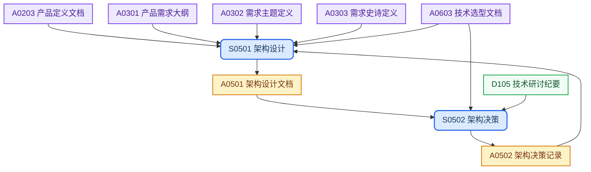
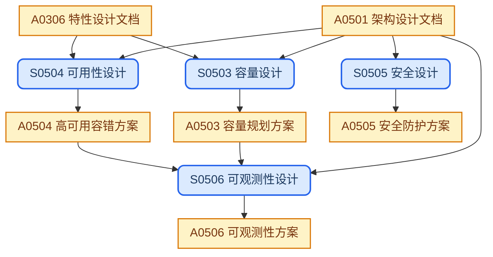

## 目录结构

产品级文档，跨 Feature 聚合提炼系统级技术上下文，产出系统架构与架构决策，设计背景并入架构设计文档。

```text
architecture/
├── architecture.md             # 系统架构 (产品级)
├── capacity.md                 # 容量规划方案 (产品级)
├── high-availability.md        # 高可用容错方案 (产品级)
├── security.md                 # 安全防护方案 (产品级)
├── observability.md            # 可观测性方案 (产品级)
└── adrs/                       # 架构决策记录 (实例级)
    └── adrNNN-<topic>.md
```

## 工作流程

### 架构设计



### 非功能性设计



## SOP规范

| ID | Name | Description | Process |
| :--- | :--- | :--- | :--- |
| S0501 | 架构设计 | 确定系统边界与 C4 架构视图，建立产品级技术实现基线 | `{design-base}/process/sop-arch-design.md` |
| S0502 | 架构决策 | 评估技术方案选项，形成可追溯的架构决策记录 | `{design-base}/process/sop-adr.md` |
| S0503 | 容量设计 | 建立系统资源基线与 SLO，制定弹性扩容策略 | `{design-base}/process/sop-capacity-design.md` |
| S0504 | 可用性设计 | 定义 SLA/RTO/RPO 目标，设计熔断降级与故障恢复机制 | `{design-base}/process/sop-ha-design.md` |
| S0505 | 安全设计 | 识别系统安全威胁，制定认证鉴权与纵深防护方案 | `{design-base}/process/sop-security-design.md` |
| S0506 | 可观测性设计 | 构建系统可观测性体系，规范监控、日志与告警策略 | `{design-base}/process/sop-observability-design.md` |

## 外部输入

| ID | Name | Description | Source |
| :--- | :--- | :--- | :--- |
| D105 | 技术研讨纪要 | 技术评审与讨论会议记录 | `references/tech-review-minutes/` |

## 上游输入

| ID | Name | Description | Source |
| :--- | :--- | :--- | :--- |
| A0203 | 产品定义文档 | 产品定义文档，§9 NFR、§10 约束与依赖 | `concept/product-definition.md` |
| A0301 | 产品需求大纲 | 需求树与优先级，Theme/Epic/Feature 索引 | `requirements/requirements.md` |
| A0302 | 产品主题定义 | 业务主题与 Epic 拆分 | `requirements/<theme>/README.md` |
| A0303 | 产品史诗定义 | Epic 与 Feature 拆分 | `requirements/<theme>/<epic>/README.md` |
| A0603 | 技术选型文档 | 候选方案对比矩阵、加权评分决策、PoC 验证结果 | `technology/selections/<topic>.md` |
| A0306 | 特性设计文档 | 核心业务流程、数据约束与错误处理需求 | `requirements/<theme>/<epic>/<feature>/design.md` |

## 制品产出

| ID | Name | Description | File | Template |
| :--- | :--- | :--- | :--- | :--- |
| A0501 | 架构设计文档 | 产品级最高层技术文档，定义系统边界与模块职责，为各专项非功能设计提供统一基础 | `architecture/architecture.md` | `{design-base}/template/design/architecture.md` |
| A0502 | 架构决策记录 | 单项技术决策的正式存档，承载决策背景、备选方案与影响范围，支撑长期可追溯 | `architecture/adrs/adrNNN-<topic>.md` | `{design-base}/template/project/adr.md` |
| A0503 | 容量规划方案 | 系统运行容量基线文档，支撑资源采购、SLO 设定与弹性策略决策 | `architecture/capacity.md` | `{design-base}/template/design/capacity.md` |
| A0504 | 高可用容错方案 | 系统韧性保障蓝图，覆盖可用性目标、降级策略与故障恢复机制 | `architecture/high-availability.md` | `{design-base}/template/design/high-availability.md` |
| A0505 | 安全防护方案 | 系统安全基线文档，定义威胁边界、访问控制模型与合规审计要求 | `architecture/security.md` | `{design-base}/template/design/security.md` |
| A0506 | 可观测性方案 | 系统运行可见性蓝图，规范指标、日志与追踪标准，驱动告警与运维响应 | `architecture/observability.md` | `{design-base}/template/design/observability.md` |

## 工作规则

- `{design-base}` 指 [it188-networkx/design-base](https://github.com/it188-networkx/design-base) 仓库，在当前 workspace 中对应子目录 `design-base/`。
- 建立或修改任意制品前，必须按以下顺序读取文件，缺一不可：
    1. 读取 **SOP 文件**：从 SOP规范 表格找到对应行的 Process 路径，用 read_file 读取全文，严格遵照其中的每一个步骤和指令执行。
    2. 读取 **制品模版文件**：从制品产出表格找到对应行的 Template 路径，用 read_file 读取全文，严格遵照模版中的结构、章节要求和注释指令生成内容。
    3. 两份文件中的指令若有冲突，以 SOP 文件为准。
- 将老的 A101 设计背景文档内容融入新的 A0501 架构设计文档，并清理重复章节与引用。
- 删除 原来S101，相关工作并入S0501，更新评审检查点与流程说明。
- A0501 架构设计文档须内嵌系统测试策略章节（测试金字塔、覆盖率目标、单元测试规范、测试数据管理、CI 质量门禁），不再单独产出测试策略文档（A1001 test-policy.md）。
