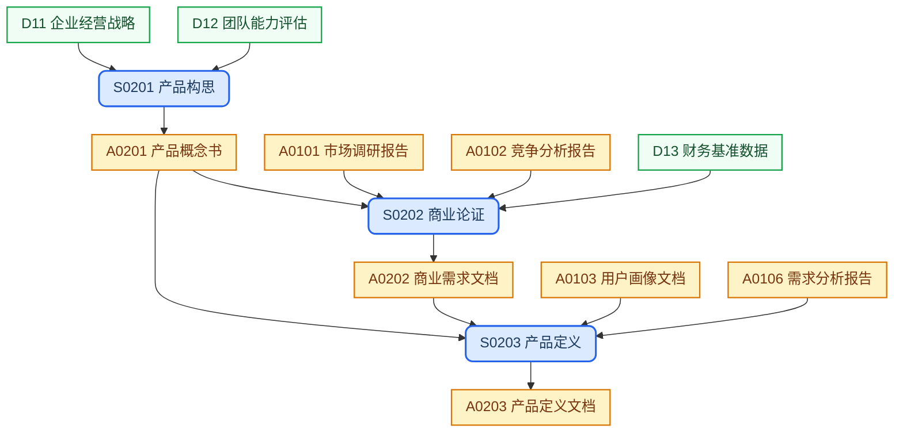

## 产品类型

- variant = tool

## 目录结构

产品级文档，记录从概念到定义的演进。

```text
concept/
├── product-concept.md          # 产品概念书
├── business-requirement.md     # 商业需求文档 (商业需求文档)
└── product-definition.md       # 产品定义文档 (产品定义文档)
```

## 工作流程



## SOP规范

| ID | Name | Description | Process |
| :--- | :--- | :--- | :--- |
| S0201 | 产品构思 | 结合企业战略与团队能力，确立产品核心方向与初步假设 | `{product-base}/process/sop-product-concept-{variant}.md` |
| S0202 | 商业论证 | 评估替代方案成本与 ROI，为内部立项提供决策依据 | `{product-base}/process/sop-business-requirement-{variant}.md` |
| S0203 | 产品定义 | 锁定产品定位、边界与核心功能范围，建立研发立项基准 | `{product-base}/process/sop-product-definition.md` |

## 外部输入

| ID | Name | Description | Source |
| :--- | :--- | :--- | :--- |
| D11 | 企业经营战略 | 公司战略方向与经营目标 | `{product-base}/references/business-strategy.md` |
| D12 | 团队能力评估 | 团队技术和业务能力现状 | `{product-base}/references/team-capability.md` |
| D13 | 财务基准数据 | 成本、收入等财务基准 | `{product-base}/references/financial-baseline.md` |

## 上游输入

| ID | Name | Description | Source |
| :--- | :--- | :--- | :--- |
| A0101 | 市场调研报告 | 市场调研结论与洞察 | `discovery/market/` |
| A0102 | 竞争分析报告 | 竞品对标分析结论 | `discovery/competitors/` |
| A0103 | 用户画像文档 | 用户研究发现与画像 | `discovery/users/` |
| A0106 | 需求分析报告 | 结构化需求与商业价值评估 | `discovery/requirements/` |

## 制品产出

| ID | Name | Description | File | Template |
| :--- | :--- | :--- | :--- | :--- |
| A0201 | 产品概念书 | 概念阶段首份产品文件，记录核心方向与战略假设 | `product-concept.md` | `{product-base}/template/concept/product-concept-{variant}.md` |
| A0202 | 商业需求文档 | 论证替代方案对比与 ROI，为内部立项决策提供依据 | `business-requirement.md` | `{product-base}/template/concept/business-requirement-{variant}.md` |
| A0203 | 产品定义文档 | 明确产品定位、边界与核心功能范围，作为需求与设计的输入基准 | `product-definition.md` | `{product-base}/template/concept/product-definition.md` |

## 工作规则

- `{product-base}` 指 [it188-networkx/product-base](https://github.com/it188-networkx/product-base) 仓库，在当前 workspace 中对应子目录 `product-base/`。
- `{variant}` 取本文件顶部 `variant = tool` 声明的值；如需切换须同步更新该声明。
- 建立或修改任意制品前，必须按以下顺序读取文件，缺一不可：
    1. 读取 **SOP 文件**：从 SOP规范 表格找到对应行的 Process 路径，用 read_file 读取全文，严格遵照其中的每一个步骤和指令执行。
    2. 读取 **制品模版文件**：从制品产出表格找到对应行的 Template 路径，用 read_file 读取全文，严格遵照模版中的结构、章节要求和注释指令生成内容。
    3. 两份文件中的指令若有冲突，以 SOP 文件为准。
