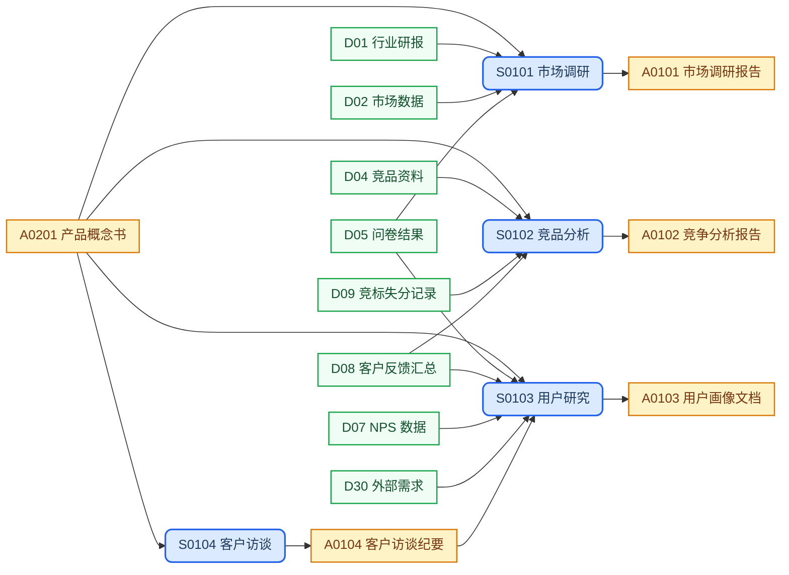
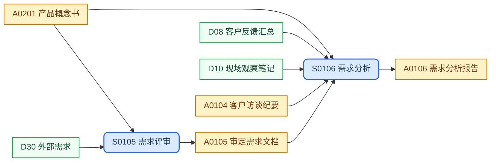

## 目录结构

实例级文档，同一类型可有多份实例，按子目录分类归档。

```text
discovery/
├── market/                     # 市场调研
│   └── <topic>.md
├── competitors/                # 竞品分析
│   └── <product>.md
├── users/                      # 用户研究
│   └── <role>-<topic>.md        #   用户研究报告
├── interviews/                 # 客户访谈
│   └── <role>-<topic>.md        #   客户访谈纪要
└── requirements/               # 需求分析
    ├── req-<topic>.md          #   需求分析
    └── rev-<topic>.md          #   需求评审
```

## 工作流程

### 需求发现



### 需求管理



## SOP规范

| ID | Name | Description | Process |
| :--- | :--- | :--- | :--- |
| S0101 | 市场调研 | 收集行业趋势与竞争格局情报，识别产品市场机会 | `{product-base}/process/sop-market-research.md` |
| S0102 | 竞品分析 | 系统对标竞品功能与策略，发现差异化竞争空间 | `{product-base}/process/sop-competitive-analysis.md` |
| S0103 | 用户研究 | 通过问卷与访谈构建用户画像与体验地图 | `{product-base}/process/sop-user-research.md` |
| S0104 | 客户访谈 | 执行访谈提纲，沉淀调研纪要与需求证据 | `{product-base}/process/sop-customer-interview.md` |
| S0105 | 需求评审 | 对输入需求分类、优先级评估与处理路径分流 | `{product-base}/process/sop-requirement-review.md` |
| S0106 | 需求分析 | 从调研材料提炼结构化需求，输出商业价值评估 | `{product-base}/process/sop-requirement-analysis.md` |

## 外部输入

| ID | Name | Description | Source |
| :--- | :--- | :--- | :--- |
| D01 | 行业研报 | 第三方行业研究报告 | `references/industry-reports/` |
| D02 | 市场数据 | 市场规模与趋势数据 | `references/market-data/` |
| D04 | 竞品资料 | 竞品产品公开资料与体验记录 | `references/competitor-materials/` |
| D05 | 问卷结果 | 用户调研问卷统计结果 | `references/surveys/` |
| D07 | NPS 数据 | 净推荐值调查数据 | `references/nps/` |
| D08 | 客户反馈汇总 | 多渠道客户反馈聚合 | `references/customer-feedback/` |
| D09 | 竞标失分记录 | 竞标过程中的失分项记录 | `references/bid-losses/` |
| D10 | 现场观察笔记 | 用户现场观察与记录 | `references/field-observations/` |
| D30 | 外部需求 | 来自外部渠道的需求输入 | `references/external-requirements/` |

## 上游输入

| ID | Name | Description | Source |
| :--- | :--- | :--- | :--- |
| A0201 | 产品概念书 | 产品方向与核心假设概述 | `concept/product-concept.md` |

## 制品产出

| ID | Name | Description | File | Template |
| :--- | :--- | :--- | :--- | :--- |
| A0101 | 市场调研报告 | 行业趋势与竞争格局研究结论，需求发现阶段的市场基准 | `market/<topic>.md` | `{product-base}/template/discovery/market-research.md` |
| A0102 | 竞争分析报告 | 竞品功能与策略对标结论，支撑差异化产品定位决策 | `competitors/<product>.md` | `{product-base}/template/discovery/competitive-analysis.md` |
| A0103 | 用户画像文档 | 用户分群特征与核心场景摘要，需求提炼的用户视角基准 | `users/<role>-<topic>.md` | `{product-base}/template/discovery/user-research.md` |
| A0104 | 客户访谈纪要 | 访谈内容结构化记录，用户研究与需求分析的一手证据 | `interviews/<role>-<topic>.md` | `{product-base}/template/discovery/customer-interview.md` |
| A0105 | 审定需求文档 | 经需求评审确认的规范化需求条目，需求分析的正式输入基线 | `requirements/rev-<topic>.md` | `{product-base}/template/discovery/requirement-review.md` |
| A0106 | 需求分析报告 | 结构化需求清单与商业价值评估，需求发现阶段最终产出 | `requirements/req-<topic>.md` | `{product-base}/template/discovery/requirement-analysis.md` |

## 工作规则

- `{product-base}` 指 [it188-networkx/product-base](https://github.com/it188-networkx/product-base) 仓库，在当前 workspace 中对应子目录 `product-base/`。
- 建立或修改任意制品前，必须按以下顺序读取文件，缺一不可：
    1. 读取 **SOP 文件**：从 SOP规范 表格找到对应行的 Process 路径，用 read_file 读取全文，严格遵照其中的每一个步骤和指令执行。
    2. 读取 **制品模版文件**：从制品产出表格找到对应行的 Template 路径，用 read_file 读取全文，严格遵照模版中的结构、章节要求和注释指令生成内容。
    3. 两份文件中的指令若有冲突，以 SOP 文件为准。
