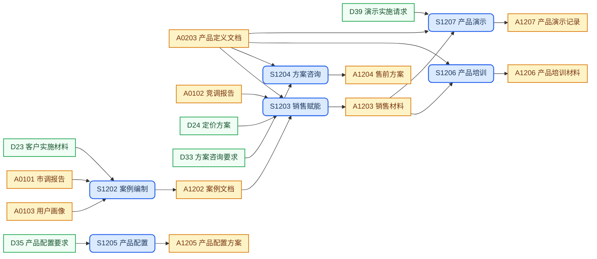

## 目录结构

实例级文档，同一类型可有多份实例，按子目录分类归档。

```text
enablement/
├── cases/                          # 案例文档
│   └── cas-<topic>.md
├── sales/                          # 销售材料
│   └── sal-<topic>.md
├── solutions/                      # 售前方案
│   └── sol-<topic>.md
├── configs/                        # 产品配置方案
│   └── cfg-<topic>.md
├── training/                       # 产品培训材料
│   └── trn-<topic>.md
└── demos/                          # 产品演示记录
    └── dem-<topic>.md
```

## 工作流程



## SOP规范

| ID | Name | Description | Process |
| :--- | :--- | :--- | :--- |
| S1202 | 案例编制 | 提炼客户成功实践，输出可复用的产品案例材料 | `{product-base}/process/sop-customer-case.md` |
| S1203 | 销售赋能 | 面向销售场景制作产品支持材料，赋能销售团队 | `{product-base}/process/sop-sales-enablement.md` |
| S1204 | 方案咨询 | 面向客户咨询需求，输出定制化售前解决方案 | `{product-base}/process/sop-solution-consult.md` |
| S1205 | 产品配置 | 根据客户要求制定产品配置方案 | `{product-base}/process/sop-product-config.md` |
| S1206 | 产品培训 | 面向客户与销售团队开展产品培训 | `{product-base}/process/sop-product-training.md` |
| S1207 | 产品演示 | 执行产品演示，记录过程与客户反馈 | `{product-base}/process/sop-product-demo.md` |

## 外部输入

| ID | Name | Description | Source |
| :--- | :--- | :--- | :--- |
| D23 | 客户实施材料 | 客户侧实施过程材料 | `references/customer-implementations/` |
| D24 | 定价方案 | 产品定价策略与报价参考 | `references/pricing/` |
| D33 | 方案咨询要求 | 客户提出的售前方案咨询需求 | `references/solution-requests/` |
| D35 | 产品配置要求 | 客户提出的产品配置需求 | `references/config-requests/` |
| D39 | 演示实施请求 | 客户或内部提出的演示请求 | `references/demo-requests/` |

TODO：这里有不少是需要SOP化的，要结合ops-playbook来看。

## 上游输入

| ID | Name | Description | Source |
| :--- | :--- | :--- | :--- |
| A0203 | 产品定义文档 | 产品定义文件，明确产品边界与定位 | `concept/product-definition.md` |
| A0101 | 市调报告 | 市场调研结论与洞察 | `discovery/market/` |
| A0102 | 竞调报告 | 竞品对标分析结论 | `discovery/competitors/` |
| A0103 | 用户画像 | 用户研究发现与画像 | `discovery/users/` |

## 制品产出

| ID | Name | Description | File | Template |
| :--- | :--- | :--- | :--- | :--- |
| A1202 | 案例文档 | 可复用的客户成功案例，销售引用与内容营销的素材来源 | `cases/cas-<topic>.md` | `{product-base}/template/enablement/case-study.md` |
| A1203 | 销售材料 | 覆盖典型销售场景的产品支持材料，销售赋能阶段主要交付 | `sales/sal-<topic>.md` | `{product-base}/template/enablement/sales-material.md` |
| A1204 | 售前方案 | 面向客户咨询的定制化解决方案，售前阶段主交付 | `solutions/sol-<topic>.md` | `{product-base}/template/enablement/solution.md` |
| A1205 | 产品配置方案 | 基于客户要求的产品配置说明，实施阶段执行依据 | `configs/cfg-<topic>.md` | `{product-base}/template/enablement/product-config.md` |
| A1206 | 产品培训材料 | 面向客户与销售的培训课件与讲义，产品认知建立的主要载体 | `training/trn-<topic>.md` | `{product-base}/template/enablement/training-material.md` |
| A1207 | 产品演示记录 | 演示过程与客户反馈的完整记录，演示脚本优化的主要依据 | `demos/dem-<topic>.md` | `{product-base}/template/enablement/demo-record.md` |

## 工作规则

- `{product-base}` 指 [it188-networkx/product-base](https://github.com/it188-networkx/product-base) 仓库，在当前 workspace 中对应子目录 `product-base/`。
- 建立或修改任意制品前，必须按以下顺序读取文件，缺一不可：
    1. 读取 **SOP 文件**：从 SOP规范 表格找到对应行的 Process 路径，用 read_file 读取全文，严格遵照其中的每一个步骤和指令执行。
    2. 读取 **制品模版文件**：从制品产出表格找到对应行的 Template 路径，用 read_file 读取全文，严格遵照模版中的结构、章节要求和注释指令生成内容。
    3. 两份文件中的指令若有冲突，以 SOP 文件为准。
