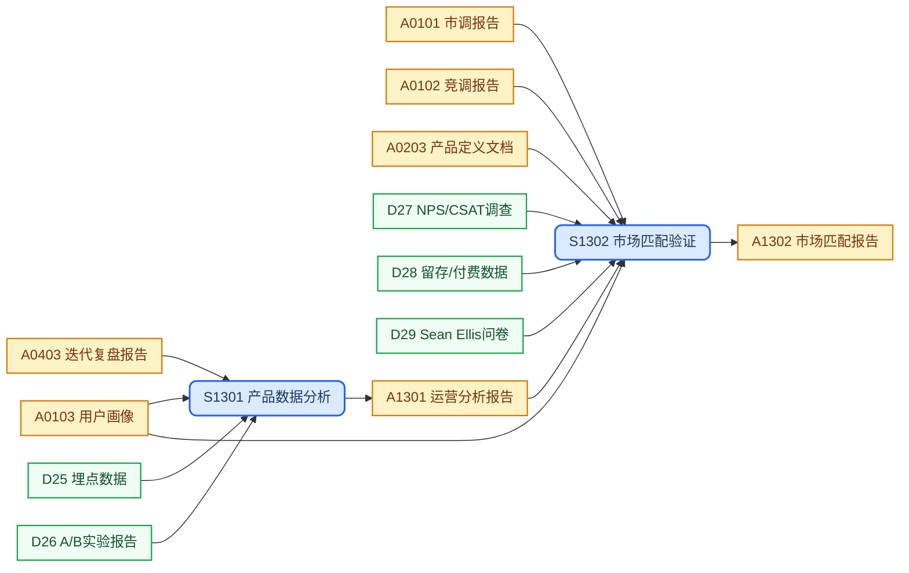
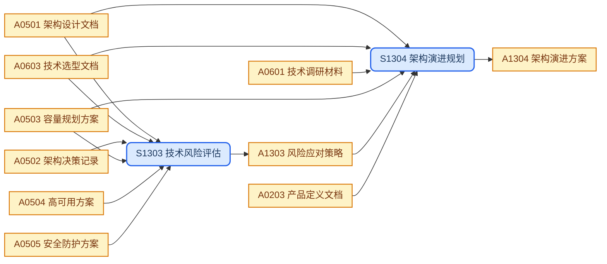

## 目录结构

产品级文档，整合产品增长分析与架构演进内容，制品直接存放于目录根部或对应子目录。

```text
evolution/
├── analytics/                      # 增长分析
│   └── da-<topic>.md               #   数据分析报告
├── pmf/                            # PMF 验证
│   └── pmf-<period>.md             #   PMF 分析报告
├── risk.md                         # 风险应对策略         → evolution/risk.md
└── evolution.md                    # 架构演进方案         → evolution/evolution.md
```

## 工作流程

### 产品演进



### 技术演进



## SOP规范

| ID | Name | Description | Process |
| :--- | :--- | :--- | :--- |
| S1301 | 产品数据分析 | 整合埋点与实验数据，量化增长驱动因素与用户流失节点 | `{product-base}/process/sop-data-analysis.md` |
| S1302 | 市场匹配验证 | 综合留存、NPS 与使用深度数据，评估产品-市场匹配阶段并形成战略结论 | `{product-base}/process/sop-pmf-analysis.md` |
| S1303 | 技术风险评估 | 汇总跨层级技术风险，按 Risk Matrix 评级并制定缓解措施与应急预案 | `{design-base}/process/sop-risk-design.md` |
| S1304 | 架构演进规划 | 基于架构基线与容量预估，规划分阶段技术演进路径并制定技术债务治理方案 | `{design-base}/process/sop-evolution-design.md` |

## 外部输入

| ID | Name | Description | Source |
| :--- | :--- | :--- | :--- |
| D25 | 埋点数据 | 产品内用户行为埋点数据 | `references/tracking/` |
| D26 | A/B 实验报告 | A/B 测试实验结果 | `references/ab-test/` |
| D27 | NPS/CSAT 调查 | 满意度与推荐度调查数据 | `references/nps-csat/` |
| D28 | 留存/付费数据 | 用户留存率与付费转化数据 | `references/retention/` |
| D29 | Sean Ellis 问卷 | PMF 核心问卷调查结果 | `references/sean-ellis/` |

## 上游输入

| ID | Name | Description | Source |
| :--- | :--- | :--- | :--- |
| A0101 | 市调报告 | 市场调研结论与洞察 | `discovery/market/` |
| A0102 | 竞调报告 | 竞品对标分析结论 | `discovery/competitors/` |
| A0103 | 用户画像 | 用户研究发现与画像 | `discovery/users/` |
| A0203 | 产品定义文档 | 产品定义文件，提供里程碑与成功指标 | `concept/product-definition.md` |
| A0403 | 迭代复盘报告 | 迭代回顾总结与改进项 | `roadmap/retro-<version>.md` |
| A0501 | 架构设计文档 | 系统架构基线，含技术选型风险 | `architecture/architecture.md` |
| A0502 | 架构决策记录 | ADR 中各次架构决策的已知风险 | `architecture/adrs/` |
| A0503 | 容量规划方案 | 增长预估与扩容拐点，驱动演进触发条件 | `architecture/capacity.md` |
| A0504 | 高可用方案 | 高可用架构设计基线 | `architecture/high-availability.md` |
| A0505 | 安全防护方案 | 安全设计基线，纳入风险评估维度 | `architecture/security.md` |
| A0601 | 技术调研材料 | 技术调研过程材料，支撑演进方向判断 | `technology/research/` |
| A0603 | 技术选型文档 | 技术选型决策与风险评估 | `technology/selections/<topic>.md` |

## 制品产出

| ID | Name | Description | File | Template |
| :--- | :--- | :--- | :--- | :--- |
| A1301 | 运营分析报告 | 增长分析基准文档，揭示关键行为特征与转化漏斗，支撑迭代方向与运营策略调整 | `evolution/analytics/da-<topic>.md` | `{product-base}/template/growth/data-analysis.md` |
| A1302 | 市场匹配报告 | PMF 阶段性评估文档，综合多维指标判定市场匹配阶段，输出 Go/Invest/Pivot 战略决策依据 | `evolution/pmf/pmf-<period>.md` | `{product-base}/template/growth/pmf-analysis.md` |
| A1303 | 风险应对策略 | 产品级风险管理基线，覆盖风险清单、评级矩阵与监控响应预案 | `evolution/risk.md` | `{design-base}/template/design/risk.md` |
| A1304 | 架构演进方案 | 架构演进蓝图，定义分阶段技术迁移路径、量化触发条件与技术债务治理策略 | `evolution/evolution.md` | `{design-base}/template/design/evolution.md` |

## 工作规则

- `{product-base}` 指 [it188-networkx/product-base](https://github.com/it188-networkx/product-base) 仓库，在当前 workspace 中对应子目录 `product-base/`。
- `{design-base}` 指 [it188-networkx/design-base](https://github.com/it188-networkx/design-base) 仓库，在当前 workspace 中对应子目录 `design-base/`。
- 建立或修改任意制品前，必须按以下顺序读取文件，缺一不可：
    1. 读取 **SOP 文件**：从 SOP规范 表格找到对应行的 Process 路径，用 read_file 读取全文，严格遵照其中的每一个步骤和指令执行。
    2. 读取 **制品模版文件**：从制品产出表格找到对应行的 Template 路径，用 read_file 读取全文，严格遵照模版中的结构、章节要求和注释指令生成内容。
    3. 两份文件中的指令若有冲突，以 SOP 文件为准。
