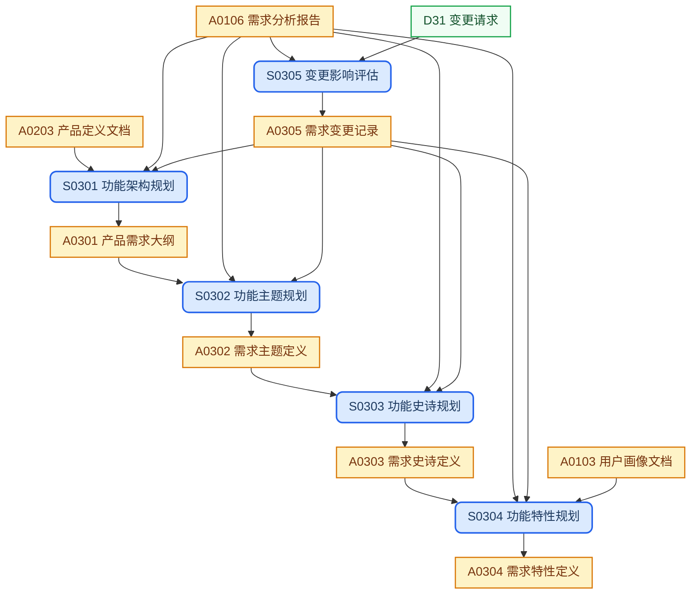
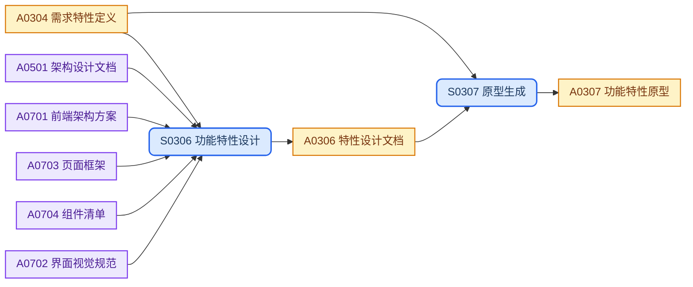

## 设计变体

<!-- design-variant 用于 A0306 / S0306 的功能特性设计变体，初始化后不应随意变更 -->
<!-- 可选值（选其一填写到下方声明中）：
    - bs       # 标准业务系统，面向前后端代码实现
    - lowcode  # 低代码应用，面向模块、页面、工作流与权限配置实现
-->
- design-variant = lowcode

## 目录结构

层级式需求文档，按需求树 Theme → Epic → Feature 逐层展开，配合变更管理确保需求可追溯。

> **说明**：文档路径中的 `{product-base}` 指 [it188-networkx/product-base](https://github.com/it188-networkx/product-base) 仓库，通常作为独立子目录位于当前 workspace 根目录下。

```text
requirements/
├── requirements.md             # 产品需求大纲
├── changes/                    # 变更管理 (实例级)
│   └── <topic>.md              #   需求变更记录
└── <theme>/                    # Theme 主题目录
    ├── README.md               #   需求主题定义
    └── <epic>/                 #   Epic 目录
        ├── README.md           #     需求史诗定义
        └── <feature>/          #     Feature 目录
            ├── README.md       #       需求特性定义
            ├── design.md       #       功能特性设计（按 design-variant 选择模版与 SOP）
            └── prototype/      #       功能特性原型
                ├── *           #       原型程序代码
```

## 工作流程

### 产品规划



### 产品设计

> S0306 与 A0306 按本文件顶部 `design-variant` 选择对应的 SOP 和模版。



## SOP规范

| ID | Name | Description | Process |
| :--- | :--- | :--- | :--- |
| S0301 | 功能架构规划 | 编制产品功能架构与需求主题目录 | `{product-base}/process/sop-prd-master.md` |
| S0302 | 功能主题规划 | 按价值流组织业务主题与 Epic 拆分 | `{product-base}/process/sop-prd-theme.md` |
| S0303 | 功能史诗规划 | 按能力闭环细化 Epic 与 Feature 拆分 | `{product-base}/process/sop-prd-epic.md` |
| S0304 | 功能特性规划 | 定义最小可交付功能单元 | `{product-base}/process/sop-prd-feature.md` |
| S0305 | 变更影响评估 | 评估变更对范围、成本、排期与风险的影响，形成处置结论 | `{product-base}/process/sop-change-impact.md` |
| S0306 | 功能特性设计 | 按实现方式产出特性实现方案：`bs` 侧重交互、数据、接口与后端逻辑；`lowcode` 侧重对象、页面、工作流与权限配置 | `{product-base}/process/sop-tech-design-{design-variant}.md` |
| S0307 | 原型生成 | 生成覆盖核心交互流程的可演示功能特性原型 | `{product-base}/process/sop-ux-design.md` |

## 外部输入

| ID | Name | Description | Source |
| :--- | :--- | :--- | :--- |
| D31 | 变更请求 | 外部变更请求输入 | `references/external-requirements/<topic>.md` |

## 上游输入

| ID | Name | Description | Source |
| :--- | :--- | :--- | :--- |
| A0103 | 用户画像文档 | 用户研究发现与画像 | `discovery/users/` |
| A0106 | 需求分析报告 | 结构化需求与商业价值评估 | `discovery/requirements/` |
| A0203 | 产品定义文档 | 产品定义文件，明确范围与定位 | `concept/product-definition.md` |
| A0501 | 架构设计文档 | 系统边界、模块划分、部署拓扑等架构约束 | `architecture/architecture.md` |
| A0701 | 前端架构方案 | 前端技术栈、路由与状态管理约束 | `ui/<platform>/architecture.md` |
| A0703 | 页面框架 | 页面层级、导航与路由编排输入 | `ui/<platform>/pages.md` |
| A0704 | 组件清单 | 组件职责边界与复用策略输入 | `ui/<platform>/components.md` |
| A0702 | 界面视觉规范 | 视觉规范、交互反馈与可用性约束 | `ui/<platform>/ui-specs.md` |

## 制品产出

| ID | Name | Description | File | Template |
| :--- | :--- | :--- | :--- | :--- |
| A0301 | 产品需求大纲 | 需求树顶层索引，锁定功能架构全景与主题优先级 | `requirements.md` | `{product-base}/template/requirements/prd-master.md` |
| A0302 | 需求主题定义 | 业务主题聚合基线，确立各主题目标与 Epic 边界 | `<theme>/README.md` | `{product-base}/template/requirements/prd-theme.md` |
| A0303 | 需求史诗定义 | 主题内 Epic 拆分基线，界定交付范围与验收标准 | `<theme>/<epic>/README.md` | `{product-base}/template/requirements/prd-epic.md` |
| A0304 | 需求特性定义 | 最小可交付功能单元，驱动设计与实现的原子基线 | `<theme>/<epic>/<feature>/README.md` | `{product-base}/template/requirements/prd-feature.md` |
| A0305 | 需求变更记录 | 变更影响与处置结论的追溯存档 | `changes/<topic>.md` | `{product-base}/template/requirements/change-impact.md` |
| A0306 | 特性设计文档 | 特性级实现设计基线；`bs` 面向前后端研发交付，`lowcode` 面向低代码配置与扩展交付 | `<theme>/<epic>/<feature>/design.md` | `{product-base}/template/requirements/feature-design-{design-variant}.md` |
| A0307 | 功能特性原型 | 可演示功能特性原型，验证核心交互流程与操作路径 | `<theme>/<epic>/<feature>/prototype/` | `{product-base}/prototypes/common/skeleton.html` |

## 新老编号对比

本阶段的SOP和制品产出重新编号，分别按照S03XX和A03XX，进行合理排序，并在做好新老编号对照表。

### SOP

| 新编号 | 旧编号 | 名称 |
| :--- | :--- | :--- |
| S0301 | S08 | 功能架构规划 |
| S0302 | S09 | 功能主题规划 |
| S0303 | S10 | 功能史诗规划 |
| S0304 | S11 | 功能特性规划 |
| S0305 | S26 | 变更影响评估 |
| S0306 | S15/S16 | 功能特性设计 |
| S0307 | - | 原型生成 |

### 制品

| 新编号 | 旧编号 | 名称 |
| :--- | :--- | :--- |
| A0301 | A08 | 产品需求大纲 |
| A0302 | A09 | 需求主题定义 |
| A0303 | A10 | 需求史诗定义 |
| A0304 | A11 | 需求特性定义 |
| A0305 | A27 | 需求变更记录 |
| A0306 | A16/A17 | 特性设计文档 |
| A0307 | - | 功能特性原型 |

## 工作规则

- `{product-base}` 指 [it188-networkx/product-base](https://github.com/it188-networkx/product-base) 仓库，在当前 workspace 中对应子目录 `product-base/`。
- `{design-variant}` 取本文件顶部 `## 设计变体` 中声明的值，仅用于 A0306 / S0306；如需切换，须同步评估既有 `design.md` 是否仍适配新的设计方法。
- 建立或修改任意制品前，必须按以下顺序读取文件，缺一不可：
    1. 读取 **SOP 文件**：从 SOP规范 表格找到对应行的 Process 路径，用 read_file 读取全文，严格遵照其中的每一个步骤和指令执行。
    2. 读取 **制品模版文件**：从制品产出表格找到对应行的 Template 路径，用 read_file 读取全文，严格遵照模版中的结构、章节要求和注释指令生成内容。
    3. 两份文件中的指令若有冲突，以 SOP 文件为准。

## 备注

- AI 编码必需的用户任务流程、表单校验、异常与空状态应写入 A0304，必要实现细节补充到 A0306。
- `design-variant = bs` 时，A0306 应覆盖前端交互、状态管理、接口契约、后端处理逻辑与非功能约束。
- `design-variant = lowcode` 时，A0306 应覆盖模块与字段、页面与区块、工作流与自动化、权限、通知与平台扩展点。
- 页面跳转关系以 `<feature>/prototype/` 原型导航结构为准，避免在 Feature 下重复维护独立 UX 流程文档。
- 颜色字体间距、组件视觉规范、响应式断点与平台差异应在 `ui/<platform>/` 文档一次性维护，不在单个 Feature 重复产出。
- 用户心智模型分析与可用性原则说明属于设计评审材料，非 AI 编码必需输入，可按需补充。
