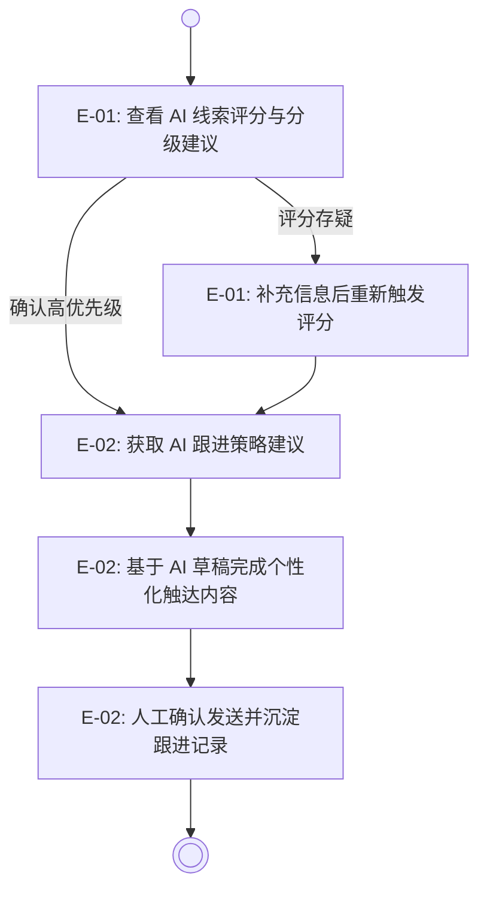
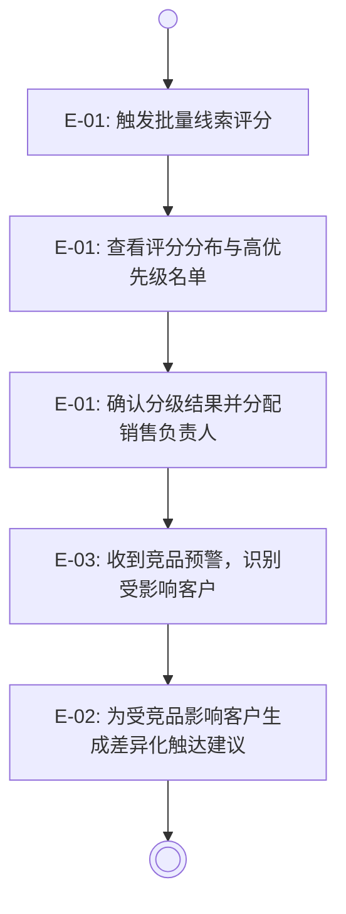

## 概述 (Overview)

**业务背景：**

当前市场与销售团队的全部线索评估、跟进策略制定与内容触达均依赖人工判断，
单次跟进准备工时超过 3 小时，且不同人员对客户意向的判断口径不一致，
导致高价值客户被低估或过度跟进、内容质量参差不齐。随着月均有效跟进客户目标提升到
100 家，人工模式的可扩展性瓶颈已显现：凭现有 1 名专职市场人员，无法支撑规模化触达。

**核心目标：**

本主题旨在将 AI 能力系统性嵌入营销运营工作流，在线索评分、跟进建议与内容生成三个
可标准化场景上以 AI 辅助替代重复判断工作，将团队有效客户覆盖规模放大至至少 3 倍，
同时确保所有 AI 输出经人工确认后生效，维持决策权完整性。

**价值承诺：**

- 覆盖规模：月均有效跟进客户数从 `<= 30 家` 提升至 `>= 100 家`（M6，与 T-01 协同贡献）。
- 建议质量：AI 跟进建议满意度（好评率）从无基线达到 `>= 3.5/5`（M3）。
- 人力等效：年化人力节省等效从 `¥0` 提升至 `>= ¥50 万`（M12，T-02 贡献 AI 增效部分）。

## 用户旅程 (User Journeys)

### 销售执行层旅程

**用户**：销售执行层（Sales Rep）

**业务闭环**：从收到待跟进线索到完成一次高质量、有记录的触达。

**跨 Epic 业务约束：**

- E-01 的评分结果必须直接驱动 E-02 的建议策略，两者共享同一客户上下文，
  避免评分逻辑与建议逻辑不一致导致的策略冲突。
- E-02 所有 AI 输出（建议与草稿）必须经人工确认后才能记录为已发送，
  满足 GC-01 AI 建议边界约束。

### MKT Leader 旅程

**用户**：MKT Leader（市场管理）

**业务闭环**：从线索池批量评分到分配培育优先级。

**跨 Epic 业务约束：**

- E-03 的竞品预警必须关联到具体客户列表，并推送给对应责任销售，
  使 E-02 的触达建议可直接纳入竞品应对语境。

## 史诗规划 (Epic Decomposition)

| Epic ID | 名称 | 优先级 | 业务定位 | 定义文档 |
| :--- | :--- | :--- | :--- | :--- |
| E-01 | AI 线索智能评分 | P0 | 对新进及存量线索实施动态评分与分级建议，提供可解释推荐，替代人工盲判并统一分级口径 | [文档](./lead-intelligence/README.md) |
| E-02 | AI 跟进辅助 | P0 | 基于客户上下文与历史跟进记录，生成下一步跟进策略建议及内容草稿，所有输出均须人工确认后生效 | [文档](./followup-copilot/README.md) |
| E-03 | 竞品预警信号 | P1 | 监控竞品动态并推送关联客户预警，辅助销售提前制定差异化应对策略 | [文档](./competitive-alerts/README.md) |

**拆分说明：**

- 基础层为 E-01 + E-02：没有 AI 评分能力，跟进建议缺乏数据支撑；没有跟进辅助，
  评分结果无法转化为行动，两者协同形成 AI 增效的最小闭环，优先级均为 P0。
- 增强层为 E-03：竞品预警依赖基础层提供的客户分类与跟进能力，
  可在基础层稳定后独立上线，不影响 MVP 先行验证。
- 协同关系上，E-01 是 E-02 的上游输入（高分客户优先获取建议），
  E-03 向 E-02 注入竞品上下文，三者形成单向依赖链。

## 验收标准 (Acceptance Criteria)

- [OC-01]评分全覆盖：所有进入系统的线索均可获得 AI 评分结果，
  评分来源与推荐理由可查，高优先级线索自动置顶呈现。
- [OC-02]建议可操作：AI 跟进建议包含明确的行动指引（下一步动作 + 时间节点建议），
  而非泛化描述；草稿内容不包含客户敏感信息明文。
- [OC-03]人工决策在环：所有 AI 建议与草稿发送前须经人工确认操作，
  系统不允许 AI 直接触达客户，满足 GC-01 AI 建议边界。
- [OC-04]信息脱敏传输：客户个人可识别信息在传送至外部 AI 服务前完成脱敏处理，
  满足 GC-03 信息脱敏约束。
- [OC-05]竞品预警可关联：预警内容可关联到受影响客户名单，
  并推送给对应责任销售，不产生无关联的空泛预警。

## 外部依赖概览 (External Dependencies Overview)

| 外部依赖 | 影响 Epic | 缺失时降级影响 |
| :--- | :--- | :--- |
| 外部 AI 推理服务（LLM/评分模型） | E-01, E-02 | 无 AI 能力，降级为规则引擎评分 + 人工建议，大幅削减增效幅度 |
| 统一客户数据上下文（T-01 线索与跟进记录） | E-01, E-02 | 评分与建议缺乏历史上下文，准确率与可操作性显著下降 |
| 竞品信息来源（外部数据订阅或内部知识库） | E-03 | 无稳定竞品数据源时，预警能力不可用 |

> 以上依赖项为 Theme 层跨 Epic 汇总，详细约束与降级策略在下游 Epic 文档定义。

## 自检清单 (Self-Check)

- [x] 用户旅程中出现的角色，在验收标准中均有业务承接，未临时引入未建模角色。
- [x] 概述中的价值承诺与验收标准（OC）双向可追溯，每项价值承诺至少被一条 OC 支撑。
- [x] 史诗规划中每个 Epic 均被至少一个用户旅程引用（通过 Epic ID）且关联文档链接已闭合，不存在悬空引用。
- [x] 用户旅程中每个 Epic 节点均能在史诗规划表中找到完全匹配的条目，不存在旅程引用了未列出的 Epic。
- [x] 外部依赖概览中的每项依赖均影响 2 个及以上 Epic，且权威来源指向的 Epic 文档编号真实存在。
- [x] 正文未出现实现侧词汇（前端控件、接口、低代码配置、服务商 API 等），内容保持架构中立。
- [x] 同一业务事实只在一个最权威章节中表达，章节之间未发生重复改写。
- [ ] A0106 需求分析报告缺失，旅程与 Epic 骨架基于 A0301 和 A0103 推导，标记 [缺少需求输入-待补充]。
