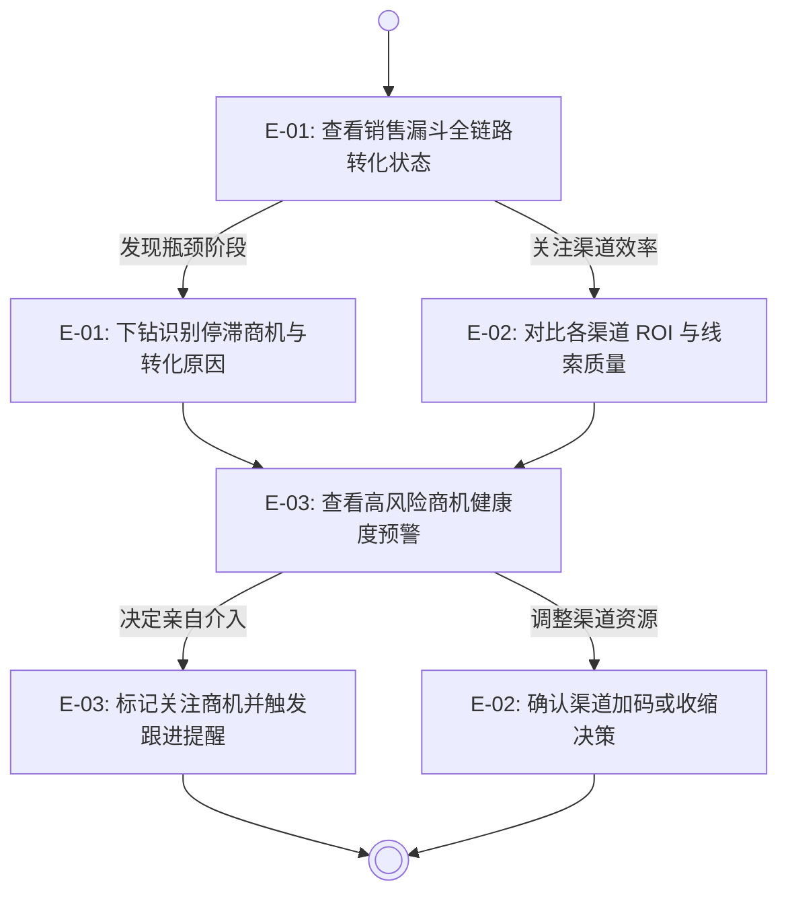

## 概述 (Overview)

**业务背景：**

公司 CEO 当前对客户转化全链路、各渠道投入产出与商机推进健康度的判断
完全依赖销售与市场人员的口头汇报，缺乏统一的数据视图。不同人员的汇报口径不一致，
导致老板难以区分"真实推进中的高质量商机"与"停滞但仍占用注意力的低质商机"，
资源分配决策凭经验拍板，高价值商机的介入时机常被延误。
渠道 ROI 无可信的量化依据，使得加码还是收缩的判断缺乏数据支撑。

**核心目标：**

本主题旨在为管理层建立一个以漏斗全链路、渠道 ROI 与商机健康度预警为核心的
自助决策视图，让 CEO 基于可信数据自主判断"哪条渠道值得加码""哪个商机值得亲自介入"，
替代依赖人工汇报的决策模式。

**价值承诺：**

- 决策自主：老板通过系统做投入决策的事项占比从 `0%` 提升至 `>= 60%`（M6）。
- 介入及时：高风险商机从停滞到管理层感知并决策介入的平均时延，
  从依赖汇报（>= 1 周）降低至系统可见（<= 24 小时）[推导-待确认]。

## 用户旅程 (User Journeys)

### CEO / 买单方旅程

**用户**：CEO（王总）/ 买单方

**业务闭环**：从查看全局商机状态到做出具体资源投入决策。

**跨 Epic 业务约束：**

- E-01 的漏斗数据必须与 T-01 的商机推进记录保持同源，
  避免两套数字导致 CEO 对数据可信度产生质疑。
- E-03 的预警触发逻辑在商机停滞判断标准上必须与 E-01 的阶段门控定义一致，
  同一商机的"停滞"判定在两个 Epic 中不得有歧义。

## 史诗规划 (Epic Decomposition)

| Epic ID | 名称 | 优先级 | 业务定位 | 定义文档 |
| :--- | :--- | :--- | :--- | :--- |
| E-01 | 销售漏斗全链路视图 | P0 | 提供从线索进入到成单全链路的转化漏斗与阶段分布，支持 CEO 识别转化瓶颈与阶段健康度 | [文档](./funnel-analytics/README.md) |
| E-02 | 渠道 ROI 对比分析 | P0 | 量化各渠道的线索量、转化率与商机价值，支持 CEO 做出有依据的渠道资源分配决策 | [文档](./channel-roi/README.md) |
| E-03 | 商机健康度预警 | P1 | 识别停滞超期、竞争威胁或推进异常的商机，推送预警使 CEO 可主动介入或指派跟进 | [文档](./opportunity-health/README.md) |

**拆分说明：**

- 基础层为 E-01 + E-02：没有漏斗全链路视图，CEO 无法建立全局感知；
  没有渠道 ROI，资源决策缺乏量化依据；两者共同构成决策驾驶舱的最小可用视图，优先级均为 P0。
- 增强层为 E-03：商机健康度预警依赖 E-01 的漏斗数据作为判断基线，
  属于主动告警增强能力，在基础层稳定后独立上线，不影响 MVP 先行验证。
- 协同关系上，E-01 与 E-02 数据相互独立但共享商机状态上下文，
  E-03 依赖 E-01 的阶段定义和商机数据触发预警逻辑。

## 验收标准 (Acceptance Criteria)

- [OC-01]漏斗数据同源：决策驾驶舱中的漏斗数据与 T-01 商机推进记录保持同源，
  CEO 与销售层看到的商机状态数字完全一致，无歧义口径。
- [OC-02]渠道 ROI 可配置：ROI 计算口径（归因模型、收益口径、成本口径）
  支持管理员配置，关键指标提供下钻路径，支持 CEO 自验证数据真实性，
  满足 GC-02 数据主权约束。
- [OC-03]预警可追踪：商机健康度预警关联具体商机，含停滞判断依据，
  CEO 标记"关注"后系统自动记录并形成可审计的操作日志，满足 GC-04 操作审计约束。
- [OC-04]权限分级访问：决策驾驶舱的数据访问按 GC-06 权限分级约束，
  老板视图与销售层视图在权限边界内独立，不暴露超出角色职责的客户信息。

## 外部依赖概览 (External Dependencies Overview)

| 外部依赖 | 影响 Epic | 缺失时降级影响 |
| :--- | :--- | :--- |
| T-01 商机推进记录（线索到成单全链路数据） | E-01, E-03 | 漏斗数据不完整，转化分析与预警触发失去基础 |
| 渠道线索来源标记与成本数据 | E-02 | 无法完成渠道 ROI 计算，降级为仅展示线索量分布 |
| 全局审计日志能力 | E-03 | 管理层操作无法形成可追溯记录，GC-04 约束无法满足 |

> 以上依赖项为 Theme 层跨 Epic 汇总，详细约束与降级策略在下游 Epic 文档定义。

## 自检清单 (Self-Check)

- [x] 用户旅程中出现的角色，在验收标准中均有业务承接，未临时引入未建模角色。
- [x] 概述中的价值承诺与验收标准（OC）双向可追溯，每项价值承诺至少被一条 OC 支撑。
- [x] 史诗规划中每个 Epic 均被至少一个用户旅程引用（通过 Epic ID）且关联文档链接已闭合，不存在悬空引用。
- [x] 用户旅程中每个 Epic 节点均能在史诗规划表中找到完全匹配的条目，不存在旅程引用了未列出的 Epic。
- [x] 外部依赖概览中的每项依赖均影响 2 个及以上 Epic，且权威来源指向的 Epic 文档编号真实存在。
- [x] 正文未出现实现侧词汇（前端控件、接口、低代码配置、服务商 API 等），内容保持架构中立。
- [x] 同一业务事实只在一个最权威章节中表达，章节之间未发生重复改写。
- [ ] A0106 需求分析报告缺失，旅程与 Epic 骨架基于 A0301 和 A0103 推导，标记 [缺少需求输入-待补充]。
- [ ] 价值承诺"介入时延"为推导值，标记 [推导-待确认]，待 CEO 访谈后核验。
