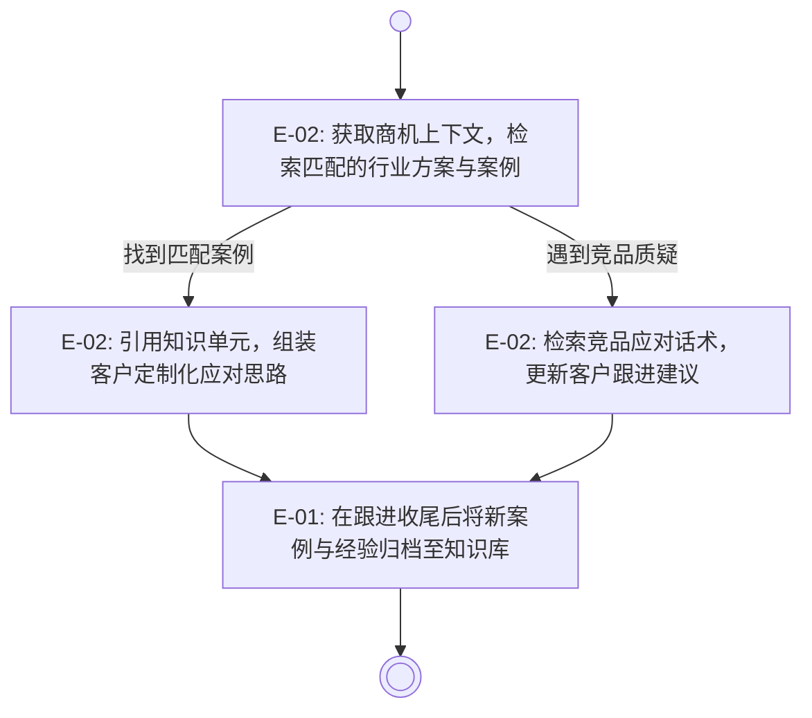
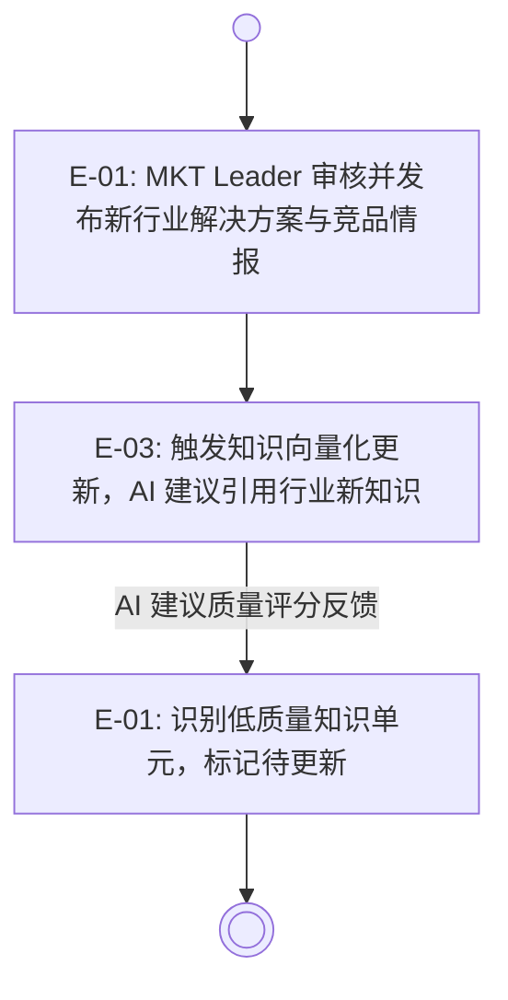

## 概述 (Overview)

**业务背景：**

公司售前团队和市场团队在面客场景中的核心竞争力来源于"能快速讲清楚
行业痛点、匹配解决方案并应对竞品质疑"，但当前这些关键知识分散在老员工的
个人记忆、历史邮件和各自本地文件中，既无法搜索，也无法传承。
新人上手需要反复向老员工取经，老员工的隐性知识一旦离职便永久流失。
AI 建议系统（T-02）若缺乏结构化行业知识输入，输出的跟进建议也难以做到
行业贴合，无法区分不同客户类型的差异化应对策略。

**核心目标：**

本主题旨在构建一个公司级可复用的结构化知识资产库，将行业解决方案沉淀、
成功案例归档、竞品应对策略与话术整理为可检索、可引用的知识单元，
支撑售前团队的快速响应能力，并为 T-02 AI 建议系统提供行业知识向量化基础。

**价值承诺：**

- 传承提速：新人独立应对客户方案沟通的达标周期从 `≥ 3 个月`（依靠传帮带）
  缩短至 `≤ 6 周`（辅以知识库自学）[推导-待确认]。
- AI 质量提升：T-02 AI 建议中被销售/售前认为"行业贴合"的比例
  从基线 0%（知识库上线前）提升至 `≥ 50%`（M6）[推导-待确认]。
- 人力等效节省：知识库贡献的售前响应效率提升，纳入年化人力节省等效
  目标 `≥ ¥50 万`（M12，与 T-01、T-02 共同分担）。

## 用户旅程 (User Journeys)

### 售前团队旅程

**用户**：售前 Leader / 售前执行层

**业务闭环**：从商机进入方案沟通阶段，到快速形成有行业依据的跟进动作。

### 市场 & AI 系统旅程

**用户**：MKT Leader / T-02 AI 建议系统

**业务闭环**：知识库定期更新与 AI 建议行业贴合度持续提升。

**跨 Epic 业务约束：**

- E-01 的知识单元在发布前须完成 GC-03 信息脱敏处理，避免将客户敏感信息
  直接归档为可被多角色检索的公开知识，否则 E-02 的检索结果将直接造成信息泄露。
- E-03 的向量化索引更新必须在 E-01 完成脱敏审核后才能触发，
  确保 AI 引用的知识单元内容经过人工确认，满足 GC-01 AI 建议边界约束。

## 史诗规划 (Epic Decomposition)

| Epic ID | 名称 | 优先级 | 业务定位 | 定义文档 |
| :--- | :--- | :--- | :--- | :--- |
| E-01 | 知识资产结构化录入与审核 | P0 | 支持将行业解决方案、成功案例与竞品话术以结构化方式录入知识库，并经人工审核与脱敏后完成发布，形成可信知识单元 | [文档](./knowledge-ingestion/README.md) |
| E-02 | 知识检索与场景推送 | P0 | 在售前跟进场景中支持按客户类型、行业、阶段检索知识单元，并将相关案例/话术推送到商机详情页，减少前置搜索成本 | [文档](./knowledge-retrieval/README.md) |
| E-03 | AI 知识向量化引用 | P1 | 将审核通过的知识单元向量化入库，支撑 T-02 AI 建议系统在生成跟进策略时引用行业贴合的知识内容，并记录引用来源以支持质量反馈 | [文档](./knowledge-vectorization/README.md) |

**拆分说明：**

- 基础层为 E-01 + E-02：没有结构化录入与审核，知识库无法形成可信内容；
  没有检索能力，售前无法在场景中使用知识；两者共同构成知识库的最小可用闭环，优先级均为 P0。
- 增强层为 E-03：向量化引用依赖 E-01 已有足够体量的经审核知识单元作为基础，
  属于 AI 增强层能力，与 T-02 Epic 协同上线，不影响 MVP 先行验证基础价值。
- 协同关系上，E-01 的知识单元审核结果是 E-02 和 E-03 的共同输入，
  三个 Epic 形成从"录入"到"使用"再到"AI 增强"的单向数据流。

## 验收标准 (Acceptance Criteria)

- [OC-01]脱敏先行：所有知识单元在进入可检索状态前，须完成 GC-03 信息脱敏审核，
  平台在发布流程中强制标记含客户名称/联系方式/商机金额等敏感字段的内容为"待脱敏"，
  未审核通过的知识单元不得出现在 E-02 检索结果或 E-03 向量库中。
- [OC-02]来源可追溯：每条知识单元须记录录入人、审核人与发布时间，
  E-03 的 AI 建议引用须关联来源知识单元 ID，满足 GC-04 操作审计约束，
  支持事后审计 AI 建议从哪条知识中生成。
- [OC-03]数据主权隔离：知识库内容的访问与编辑权限按 GC-02 数据主权约束，
  客户专属知识（如特定客户的方案历史）与行业通用知识（如行业解决方案模板）
  分类存储，前者仅限关联商机相关人员访问。
- [OC-04]AI 引用边界：E-03 的向量化知识引用满足 GC-01 AI 建议边界约束，
  AI 输出须标注"参考知识来源"，用户可查看被引用的知识单元原文，
  AI 建议本身定位为辅助输入，最终判断由售前人员确认。

## 外部依赖概览 (External Dependencies Overview)

| 外部依赖 | 影响 Epic | 缺失时降级影响 |
| :--- | :--- | :--- |
| T-02 AI 建议系统（建议生成与引用链路） | E-03 | E-03 无法与 AI 建议系统集成，降级为仅完成知识单元向量化存储，不接入实时推荐 |
| 脱敏处理能力（字段识别与打码） | E-01, E-02 | 无自动化脱敏时，降级为人工全量审核，录入效率下降，不影响发布门槛 |
| 全局操作审计日志能力 | E-01, E-03 | 审核操作与 AI 引用日志无法集中存储，GC-04 审计约束仅能在本模块内部分满足 |

> 以上依赖项为 Theme 层跨 Epic 汇总，详细约束与降级策略在下游 Epic 文档定义。

## 自检清单 (Self-Check)

- [x] 用户旅程中出现的角色，在验收标准中均有业务承接，未临时引入未建模角色。
- [x] 概述中的价值承诺与验收标准（OC）双向可追溯，每项价值承诺至少被一条 OC 支撑。
- [x] 史诗规划中每个 Epic 均被至少一个用户旅程引用（通过 Epic ID）且关联文档链接已闭合，不存在悬空引用。
- [x] 用户旅程中每个 Epic 节点均能在史诗规划表中找到完全匹配的条目，不存在旅程引用了未列出的 Epic。
- [x] 外部依赖概览中的每项依赖均影响相应 Epic，且影响路径在正文中有对应表述。
- [x] 正文未出现实现侧词汇（前端控件、接口、低代码配置、服务商 API 等），内容保持架构中立。
- [x] 同一业务事实只在一个最权威章节中表达，章节之间未发生重复改写。
- [ ] A0106 需求分析报告缺失，旅程与 Epic 骨架基于 A0301 和 A0103 推导，标记 [缺少需求输入-待补充]。
- [ ] 价值承诺中"新人达标周期"与"AI 行业贴合比例"均为推导值，标记 [推导-待确认]，待访谈后核验。
