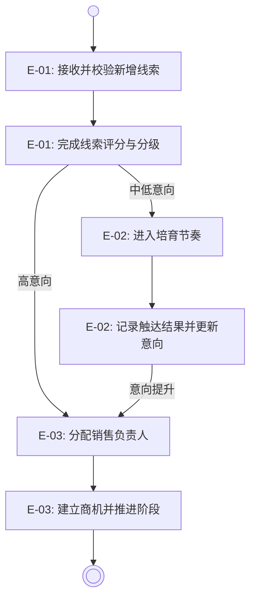
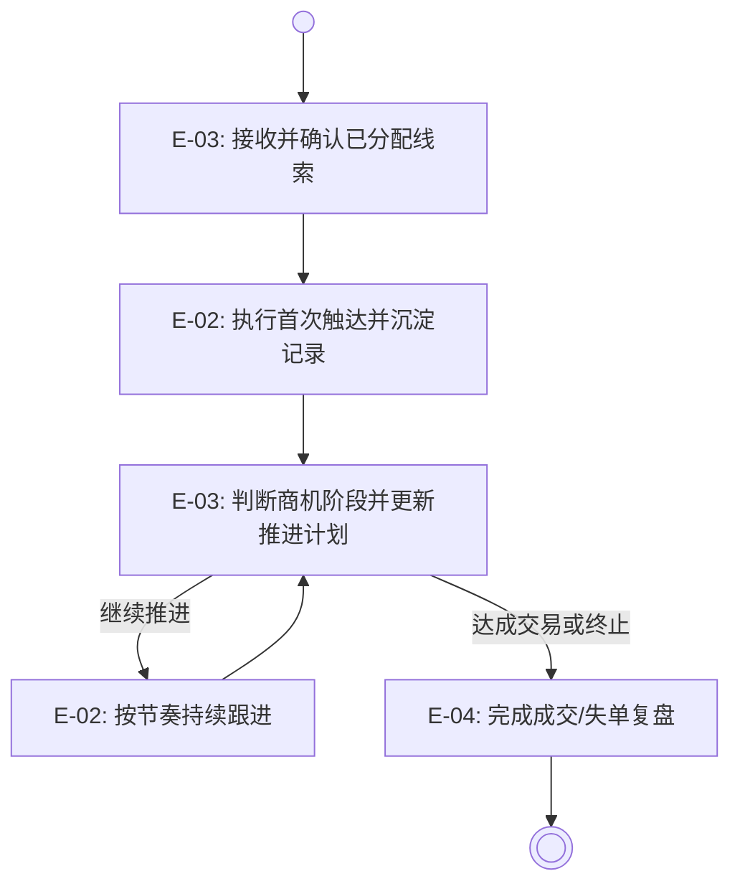

## 概述 (Overview)

**业务背景：**

当前销售与市场协同主要依赖微信、口头同步和个人记录，导致线索分级、
跟进节奏和商机推进标准不一致。团队在多节奏客户（1/3/6 个月）并行推进时，
容易出现跟进遗忘、记录断层和交接损耗。随着月均有效跟进客户规模目标提升到
100 家，现有方式难以支撑持续增长，且管理层无法基于统一事实判断推进质量。

**核心目标：**

构建一条覆盖线索录入、评分分级、培育触达、商机推进到成交复盘的统一业务闭环，
让市场与销售围绕同一客户事实协同推进，持续沉淀可交接的客户关系资产。

**价值承诺：**

- 覆盖规模：月均有效跟进客户数从 `<= 30 家` 提升至 `>= 100 家`（M6）。
- 执行效率：单次跟进备案工时从 `>= 3 小时` 降低至 `<= 30 分钟`（M6）。
- 组织增效：年化人力节省等效从 `¥0` 提升至 `>= ¥50 万`（M12，T-01 贡献部分）。

## 用户旅程 (User Journeys)

### MKT Leader 旅程

**用户**：MKT Leader（市场管理）

**业务闭环**：从线索进入系统到完成分级与分配，进入培育或销售推进。

### 销售 Leader / 执行层旅程

**用户**：销售 Leader / 销售执行层

**业务闭环**：从接收已分配线索到推进商机并完成成交复盘。

**跨 Epic 业务约束：**

- E-01 输出的线索分级结果必须直接驱动 E-02 培育策略与 E-03 分配优先级，
  避免人工二次判定导致的节奏偏差。
- E-02 的每次跟进记录必须同步影响 E-03 的阶段判断，确保推进决策基于最新事实。
- E-04 的复盘结论必须回流 E-01 评分规则与 E-02 培育策略，形成持续优化闭环。

## 史诗规划 (Epic Decomposition)

| Epic ID | 名称 | 优先级 | 业务定位 | 定义文档 |
| :--- | :--- | :--- | :--- | :--- |
| E-01 | 线索治理与分级 | P0 | 建立统一线索入口与分级口径，形成可分配、可追踪的线索池基线 | [文档](./lead-governance/README.md) |
| E-02 | 培育与跟进沉淀 | P0 | 保障多节奏客户的持续触达与结构化记录，降低遗漏与经验流失 | [文档](./nurture-followup/README.md) |
| E-03 | 商机推进与阶段门控 | P0 | 将线索转化为可管理商机，按统一阶段规则推进并可视化健康度 | [文档](./opportunity-pipeline/README.md) |
| E-04 | 成交复盘与策略回流 | P1 | 对成交与失单进行结构化复盘，将经验回流至线索与培育策略 | [文档](./winloss-retrospective/README.md) |

**拆分说明：**

- 基础层为 E-01 + E-02 + E-03：没有统一线索治理、跟进沉淀和阶段门控，
  端到端销售闭环无法成立，因此优先级均为 P0。
- 增强层为 E-04：在基础层稳定运行后，复盘能力可持续提升分级和推进质量，
  对全链路形成正反馈，但不影响最小闭环先行上线。
- 协同关系上，E-02 与 E-03 为高频双向联动，E-04 面向 E-01/E-02/E-03 提供
  策略回流，形成闭环优化机制。

## 验收标准 (Acceptance Criteria)

- [OC-01]线索统一入池：所有新增线索均进入统一线索池并完成可追踪分级，
  不存在系统外主流程分流。
- [OC-02]跟进全程留痕：从首次触达到阶段推进的关键动作均有结构化记录，
  可支持人员交接后的连续推进。
- [OC-03]阶段推进可判定：每个商机阶段的进入与停留状态具备一致判定标准，
  管理者可基于同一口径识别推进风险。
- [OC-04]闭环可复盘：成交与失单均可输出复盘结论，且结论可回流到线索分级与
  培育策略中形成持续优化。
- [OC-05]人工决策在环：涉及评分建议与推进建议的关键动作均需人工确认，
  满足 AI 建议边界约束。

## 外部依赖概览 (External Dependencies Overview)

| 外部依赖 | 影响 Epic | 缺失时降级影响 |
| :--- | :--- | :--- |
| 统一客户主数据（客户主体、联系人、历史关系） | E-01, E-02, E-03 | 无法建立稳定客户上下文，分级与推进连续性下降 |
| 组织与角色权限体系 | E-01, E-02, E-03 | 线索分配与跟进查看边界不清，协同效率与合规性受损 |
| 经营结果反馈机制（成交/失单事实回传） | E-03, E-04 | 难以完成可追溯复盘，策略回流能力缺失 |
| 审计留痕能力 | E-02, E-03, E-04 | 关键动作不可追溯，难以支撑过程复核与责任界定 |

> 以上依赖项为 Theme 层跨 Epic 汇总，详细约束与降级策略在下游 Epic 文档定义。

## 自检清单 (Self-Check)

- [x] 用户旅程中出现的角色，在验收标准中均有业务承接，未临时引入未建模角色。
- [x] 概述中的价值承诺与验收标准（OC）双向可追溯，每项价值承诺至少被一条 OC 支撑。
- [x] 史诗规划中每个 Epic 均被至少一个用户旅程引用（通过 Epic ID）且关联文档链接已闭合，不存在悬空引用。
- [x] 用户旅程中每个 Epic 节点均能在史诗规划表中找到完全匹配的条目，不存在旅程引用了未列出的 Epic。
- [x] 外部依赖概览中的每项依赖均影响 2 个及以上 Epic，且权威来源指向的 Epic 文档编号真实存在。
- [x] 正文未出现实现侧词汇（前端控件、接口、低代码配置、服务商 API 等），内容保持架构中立。
- [x] 同一业务事实只在一个最权威章节中表达，章节之间未发生重复改写。
