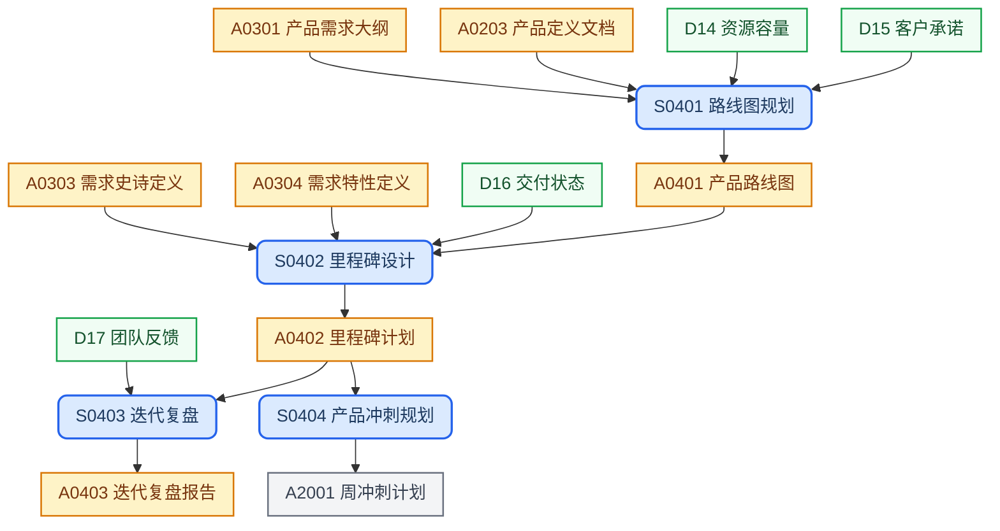

## 目录结构

路线图与交付节奏管理，包含版本规划、里程碑设计和迭代复盘。

```text
roadmap/
├── README.md                   # 路线图
├── ms-<version>.md             # 里程碑计划
└── retro-<version>.md          # 迭代复盘报告
```

## 工作流程



## SOP规范

| ID | Name | Description | Process |
| :--- | :--- | :--- | :--- |
| S0401 | 路线图规划 | 确定版本发布优先级与交付窗口，形成可承诺的产品路线图 | `{product-base}/process/sop-roadmap-plan.md` |
| S0402 | 里程碑设计 | 锁定版本关键交付节点，制定里程碑验收标准与风险管控策略 | `{product-base}/process/sop-milestone-design.md` |
| S0403 | 迭代复盘 | 评审版本交付成果与流程效能，识别改进项并输入下轮规划 | `{product-base}/process/sop-retrospective.md` |
| S0404 | 产品冲刺规划 | 基于里程碑计划圈定本周产品侧迭代范围，产出周冲刺计划产品部分草稿，汇入 ops-playbook 冲刺流程 | `{product-base}/process/sop-sprint-plan.md` |

## 外部输入

| ID | Name | Description | Source |
| :--- | :--- | :--- | :--- |
| D14 | 资源容量 | 团队资源与产能数据 | `references/resource-capacity.md` |
| D15 | 客户承诺 | 已签约客户交付承诺 | `references/customer-commitments.md` |
| D16 | 交付状态 | 当前迭代交付进度数据 | `references/delivery-status/` |
| D17 | 团队反馈 | 团队成员迭代反馈 | `references/team-feedback/` |

## 上游输入

| ID | Name | Description | Source |
| :--- | :--- | :--- | :--- |
| A0203 | 产品定义文档 | 产品定义文档，明确范围与定位 | `concept/product-definition.md` |
| A0301 | 产品需求大纲 | 产品功能架构与需求主题目录 | `requirements/requirements.md` |
| A0303 | 产品史诗定义 | Epic 与 Feature 拆分 | `requirements/<theme>/<epic>/README.md` |
| A0304 | 需求特性定义 | 最小可交付功能单元定义 | `requirements/<theme>/<epic>/<feature>.md` |

## 制品产出

| ID | Name | Description | File | Template |
| :--- | :--- | :--- | :--- | :--- |
| A0401 | 路线图 | 产品版本序列与交付节奏全貌，各版本规划的决策主干 | `README.md` | `{product-base}/template/roadmap/rm-master.md` |
| A0402 | 里程碑计划 | 版本级交付承诺基准文档，锁定关键节点与验收准入，为周冲刺规划提供输入 | `ms-<version>.md` | `{product-base}/template/roadmap/rm-milestone.md` |
| A0403 | 迭代复盘报告 | 版本迭代成果与效能复盘存档，驱动路线图修订与团队改进 | `retro-<version>.md` | `{product-base}/template/roadmap/rm-retrospective.md` |

> S0404 以 A0402 为主输入，在 [ops-playbook/sprints](https://github.com/it188-networkx/ops-playbook/tree/main/sprints) 冲刺规划流程中产出 A2001 周冲刺计划，详见 `{ops-playbook}/sprints/AGENTS.md`。

## 新老编号对比

本阶段的SOP和制品产出重新编号，分别按照S04XX和A04XX，进行合理排序，并做好新老编号对照表。

### SOP

| 新编号 | 旧编号 | 名称 |
| :--- | :--- | :--- |
| S0401 | S12 | 路线图规划 |
| S0402 | S13 | 里程碑设计 |
| S0403 | S14 | 迭代复盘 |
| S0404 | S2002 | 产品冲刺规划 |

### 制品

| 新编号 | 旧编号 | 名称 |
| :--- | :--- | :--- |
| A0401 | A13 | 路线图 |
| A0402 | A14 | 里程碑计划 |
| A0403 | A15 | 迭代复盘报告 |
