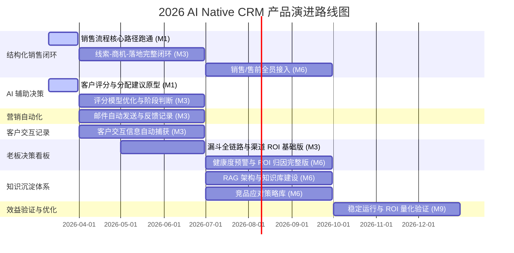

# Roadmap Master - 2026 AI Native CRM 产品战略规划

## 1. 战略摘要 (Strategic Summary)

### 1.1 年度/阶段性愿景

> **2026 年度主题**：从"零"到"已验证"。
> 在 2026 年内完成 AI Native CRM 内部工具从 0 到 1 的交付，让 ICT 运维服务小团队首次实现 AI 增效驱动的
> "1 人 ≈ 100 人运营吞吐量"，并以可量化的年化人力节省（目标 ≥ ¥50 万）完成 ROI 验证，
> 将客户关系、行业经验与竞品情报沉淀为不可替代的公司级知识资产。

### 1.2 关键商业目标 (Key Business Objectives)

1. **最小闭环首批上线（M1，2026-03）**：3 月底首批功能上线，销售流程核心路径跑通
   （线索 → 商机 → 落地），AI 客户评分原型（0-100 分）与分配建议可用，
   客户数据导入通道就绪（手工导入兜底）。
   关联 Theme：结构化销售闭环、AI 辅助决策 [会议确认]。

2. **第一阶段全功能交付（M3，2026-06）**：6 月底第一阶段全部上线，实现最小可行闭环。
   邮件营销自动化与客户交互信息自动记录上线，AI 辅助决策完善（动态评分、销售评分、
   商机阶段判断），老板决策看板基础版可用。
   关联 Theme：营销自动化、客户交互记录、AI 辅助决策、老板决策看板 [会议确认]。

3. **全团队覆盖与知识体系建设（M6，2026-09）**：销售团队与售前团队全员接入，
   月均有效跟进客户数突破 100 家。系统功能完成后启动知识库与竞品应对策略库建设，
   知识沉淀体系覆盖全团队。
   关联 Theme：结构化销售闭环、知识沉淀体系 [推导-待确认]。

4. **ROI 验证（M9，2026-12）**：全功能稳定运行，
   年化人力节省 ≥ ¥50 万可量化验证（替换约 60% 以上的手工市场执行工作），
   老板决策看板数据可信、口径与公司实际业务一致，支撑资源分配与渠道续投决策。
   关联所有 Theme [推导-待确认]。

---

## 2. 宏观路线图 (High-Level Roadmap)

### 2.1 季度规划视图 (Quarterly View)

### 2.2 详细规划表

> **说明**：Theme 清单基于 `concept/product-definition.md` §1.4 MVP 范围与
> 2026-03-04 需求讨论会议纪要综合推导。标记 [会议确认] 表示已在会议中明确，
> [推导-待确认] 待 `requirements/requirements.md` 编制完成后对齐。

| 时间周期 | 战略主题 (Theme) | 核心价值 / 交付物 | 优先级 |
| :--- | :--- | :--- | :--- |
| **2026 Q1（M1，3月底）** | **结构化销售闭环 – 核心路径** [会议确认] | 线索 → 商机 → 落地核心流程跑通；客户数据导入（手工导入兜底）；三类客户（终端/外单/其他）字段标注 | P0 |
| **2026 Q1（M1，3月底）** | **AI 辅助决策 – 评分原型** [会议确认] | 客户评分模型（0-100 分）原型；AI 辅助线索分配建议；初始评分自动计算（客户规模、行业、成立年限） | P0 |
| **2026 Q2（M3，4月–6月底）** | **营销自动化 – 邮件自动化** [会议确认] | 自动发送邮件 + 反馈记录（推送对象、打开情况追踪）；长期不打开切换推送类别 | P0 |
| **2026 Q2（M3，4月–6月底）** | **客户交互记录 – 自动捕获** [会议确认] | 客户交互行为自动记录；操作日志归档至客户/商机下统一管理 | P0 |
| **2026 Q2（M3，4月–6月底）** | **AI 辅助决策 – 完善** [会议确认] | 评分动态调整（跟进频率、反馈频率）；销售评分机制（日报、两周无跟进降分）；商机阶段判断建议；特殊阶段跳转支持 | P0 |
| **2026 Q2（M3，5月–6月底）** | **老板决策看板 – 基础版** [推导-待确认] | 商机漏斗全链路基础视图；渠道 ROI 基础版（公式待管理层确认）；替代人工汇报 | P0 |
| **2026 Q3（M6，7月–9月）** | **结构化销售闭环 – 全员接入** [推导-待确认] | 销售团队与售前团队完整接入；知识检索与竞品情报融入销售日常流程 | P0 |
| **2026 Q3（M6，7月–9月）** | **知识沉淀体系 – 知识库与竞品应对库** [会议确认] | 系统功能完成后启动知识库建设；RAG 架构上线；行业案例结构化导入；竞品应对策略库上线 | P1 |
| **2026 Q3（M6，7月–9月）** | **老板决策看板 – 完整版** [推导-待确认] | 渠道 ROI 完整对比视图；商机健康度预警；ROI 归因配置 | P1 |
| **2026 Q4（M9，10月–12月）** | **效益验证与持续优化**（全 Theme 稳定运行）[推导-待确认] | 全功能稳定运行；年化人力节省 ≥ ¥50 万可量化验证；AI 能力迭代优化 | P1 |

---

## 3. 发布节奏与版本切分策略 (Release & Versioning Strategy)

### 3.1 发布节奏

- **主要版本 (Major Releases)**：与产品里程碑（M1 / M3 / M6 / M9）对齐，每 1–3 个月发布一个 Major 版本，
  包含完整 Theme 或关键 Epic 交付，对应向产品负责人与老板的阶段性验收节点。
- **次要版本 (Minor Releases)**：双周迭代（Sprint），交付具体 Epic 或 Feature 增强，
  Sprint 周期 2 周，迭代产出存入 `sprints/` 目录。
- **热修复 (Hotfixes)**：按需随时发布，仅修复影响核心工作流（AI 建议层、商机管理）的 P0 级缺陷。

### 3.2 版本切分策略

| 版本号 | 里程碑 | 预计发布 | 交付范围 (Theme/Epic) | 交付目标 | 状态 |
| :--- | :--- | :--- | :--- | :--- | :--- |
| **V0.1** | M1 | 2026-03-31 | 结构化销售闭环（核心路径跑通）+ AI 辅助决策（评分原型）+ 客户数据导入通道 [会议确认] | 线索 → 商机 → 落地核心流程端到端可用；AI 评分模型原型可测；三类客户字段标注就绪 | 进行中 |
| **V1.0** | M3 | 2026-06-30 | 营销自动化（邮件 + 反馈）+ 客户交互自动记录 + AI 辅助决策（完善）+ 老板决策看板（基础版）[会议确认] | 第一阶段最小可行闭环全功能上线；邮件自动化运行；客户交互自动捕获；MKT Leader 接入验收 | 规划中 |
| **V1.5** | M6 | 2026-09-30 | 知识沉淀体系（知识库 + 竞品应对库）+ 结构化销售闭环（全员接入）+ 老板决策看板（完整版）[推导-待确认] | 全员接入；知识库建设启动；竞品模块上线；月均跟进客户数 ≥ 100 家 | 规划中 |
| **V2.0** | M9 | 2026-12-31 | 全 Theme 稳定迭代 + ROI 量化验证 + AI 能力持续增强 | 年化人力节省 ≥ ¥50 万可量化验证；全功能稳定运行；知识资产持续增殖 | 规划中 |

---

## 4. 风险与依赖 (Risks & Dependencies)

### 4.1 宏观风险

| 风险项 | 影响评估 | 影响版本 | 缓解计划 |
| :--- | :--- | :--- | :--- |
| **AI 建议质量不达标** | 线索评分与跟进建议针对 ICT 运维行业场景不够精准，MKT Leader 拒绝采用，周活跃使用率无法达到 ≥ 70% | V1.0 | M1 期间启动 AI 建议质量 POC 验证，围绕 ICT 运维场景微调 RAG 检索策略与 Prompt；V1.0 后持续收集用户反馈形成迭代飞轮 |
| **知识库冷启动数据不足** | 初始知识库条目不足导致 AI 建议缺乏行业背景、质量低，影响用户对 AI 层的信任与接受度 | V0.1, V1.0 | M1 前完成 ≥ 30 条结构化知识导入（行业解决方案 + 成功案例 + 竞品情报）；优先导入高频客户场景与竞品应对案例 |
| **用户录入采用阻力** | 销售/售前团队改变习惯成本高，数据回填率低形成 AI 建议质量下行的负向循环 | V1.5 | V1.0 期间优先降低录入门槛；设计即时正反馈机制（AI 建议采纳后立即展示价值）；通过 MKT Leader 先跑通验证价值并建立团队示范效应 |
| **LLM API 服务可靠性** | 依赖外部大模型 API，服务异常将导致 AI 增效工作流全线不可用，影响用户信任 | 全版本 | 设计 AI 功能降级策略（AI 不可用时 CRM 基础流程不受影响）；评估主备多模型兜底方案 [推导-待确认] |

### 4.2 外部依赖

| 依赖项 | 依赖方 | 影响范围 | 确认截止日期 | 当前状态 |
| :--- | :--- | :--- | :--- | :--- |
| 大模型 LLM API（RAG 底座与 AI 建议层核心） | AI 服务提供商（待选型） | 所有 Theme（AI 增效工作流核心依赖） | 2026-03-31 | 待选型确认 |
| 内部 ERP 数据接口（成交金额、签约日期） | 内部 IT 团队 | V1.0 老板看板数据口径一致性 | 2026-05-01 | 未立项，范围待确认 |
| 企业微信 / 飞书快捷录入接口 | 腾讯 / 字节生态开放平台 | V1.5 全员接入录入体验（降低采用阻力） | 2026-08-01 | 未评估，列为二期扩展项 |

### 4.3 关键控制点

| 控制点 | 时间节点 | 评审内容 | 决策者 |
| :--- | :--- | :--- | :--- |
| **V0.1 M1 上线评审** | 2026-04-10 | RAG 架构稳定性、知识库覆盖度（≥ 20 条）、AI 基础建议端到端可用性 | 产品负责人 + 技术负责人 |
| **V1.0 MVP 发布评审** | 2026-06-10 | 核心功能完成度 ≥ 90%，MKT Leader 验收通过，周活跃使用率 ≥ 70%，AI 建议满意度 ≥ 3.5/5 | 产品负责人 + 老板 |
| **V1.5 全员推广评审** | 2026-09-10 | 全员接入完成率、月均跟进客户数 ≥ 100 家，竞品模块功能完整性，数据回填率达标 | 产品负责人 + 老板 |
| **V2.0 ROI 验证评审** | 2026-12-31 | 年化人力节省 ROI 量化报告（目标 ≥ ¥50 万）、全功能稳定性、持续迭代计划 | 老板（买单方） |

---

## 自检清单 (Self-Check)

- [x] §1 战略摘要包含明确的年度/阶段性愿景，且与 `concept/product-definition.md` §1.1 愿景对齐
- [x] §1 关键商业目标 ≥ 3 个，每个关联到具体 Theme
- [x] §2 甘特图覆盖产品定义文档推导的所有 P0/P1 Theme（注：待 `requirements/requirements.md` 编制后重新验证对齐）
- [x] §2 详细规划表中的 Theme 已标注 [推导-待确认]，待需求大纲正式确认
- [x] §2 依赖关系在时间线上无冲突（知识库初始化先于 AI 建议层先于销售闭环全员接入）
- [x] §3 版本切分策略表中每个主要版本有：版本号、预计发布时间、交付范围、交付目标
- [x] §4 风险清单 ≥ 2 项（实际 4 项），每项含影响评估与缓解计划
- [x] §4 每个主要版本发布前有 ≥ 1 个控制点
- [x] 颗粒度控制：规划单元为 Theme 级别，未展开到具体 Feature
