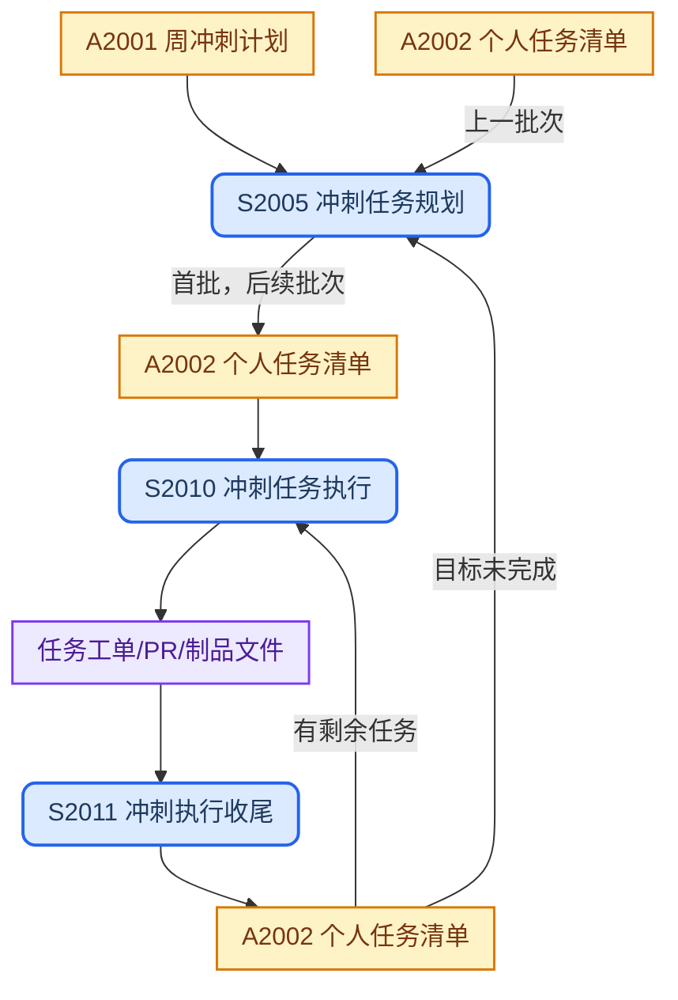

## 目录结构

冲刺执行空间，以 A2002 个人任务清单为核心，覆盖从批次规划、任务执行到收尾总结的完整产品设计迭代闭环。

```text
sprints/
└── <YYYYMMDD>/                      # 周冲刺目录，以冲刺开始日期命名
    └── <user>-tasks.md              #   A2002 个人任务清单
```

> - 冲刺目录 `<YYYYMMDD>` 以当周周一日期命名，例如 `20260303`。
> - `<user>` 为责任人英文缩写或 GitHub 用户名，与 `{ops-playbook}/team/skills.md` 中保持一致。

## 工作流程



## SOP 规范

| ID | Name | Description | Process | Issue Template |
| :--- | :--- | :--- | :--- | :--- |
| S2005 | 冲刺任务规划 | 基于 A2001 周冲刺计划（首批）或上批执行结果（后续批次），确定当前可执行任务批次并更新 A2002 | `{product-base}/process/sop-sprint-task-plan.md` | [产品设计冲刺](../../.github/ISSUE_TEMPLATE/20-05-sprint-task-plan.yml) |
| S2010 | 冲刺任务执行 | 按 A2002 已确认批次逐任务驱动 AI 执行，产出域制品文件，提交人工审核 | `{product-base}/process/sop-sprint-task-execute.md` | — |
| S2011 | 冲刺执行收尾 | 在所有当批制品审核完成后，总结执行结果、回写 A2002 任务状态，并触发下一批 S2005 规划或宣告冲刺结束 | `{product-base}/process/sop-sprint-task-close.md` | — |

## 上游输入

| ID | Name | Source |
| :--- | :--- | :--- |
| A2001 | 周冲刺计划 | `{ops-playbook}/sprints/<YYYYMMDD>/sprint-plan.md` |

## 制品产出

| ID | Name | File | Template |
| :--- | :--- | :--- | :--- |
| A2002 | 个人任务清单 | `<YYYYMMDD>/<user>-tasks.md` | `{ops-playbook}/template/sprint-tasks.md` |

## 工作规则

- `{ops-playbook}` 指 [it188-networkx/ops-playbook](https://github.com/it188-networkx/ops-playbook) 仓库，在当前 workspace 中对应子目录 `ops-playbook/`。
- `{product-base}` 指 [it188-networkx/product-base](https://github.com/it188-networkx/product-base) 仓库，在当前 workspace 中对应子目录 `product-base/`。
- 建立或修改任意制品前，先读 SOP 文件全文，再读制品模板全文，冲突时以 SOP 为准。
- S2005 输出的任务批次须经人工确认后，才可进入 S2010 执行阶段。
- S2005 首批以 A2001 为主输入；后续批次以 A2002 上批「执行结果」区块为主输入。
- S2010 产出域制品文件，须提交人工审核，审核通过后方可触发 S2011。
- S2011 须在所有当批制品审核完成（通过或明确驳回）后方可触发。
- A2002 任务状态由 S2011 统一回写：审核通过标记「已完成」，驳回标记「待修订」，未执行标记「延至下批」。
- 每批任务数量建议控制在 1-3 条，确保单批次可在一个工作日内完成审核闭环。
