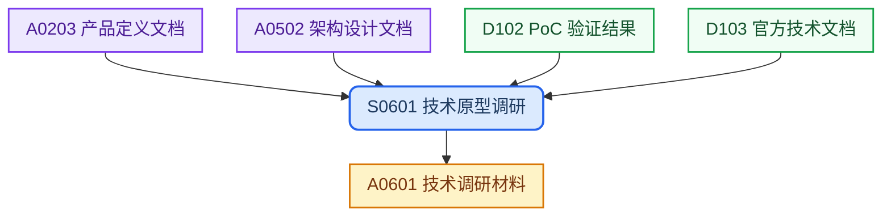
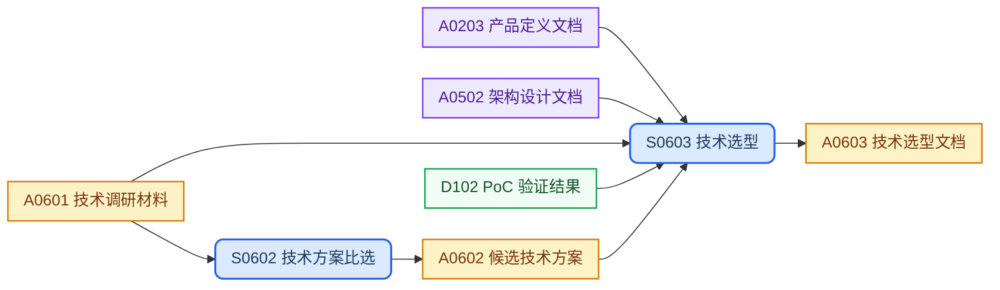

## 目录结构

实例级文档，同一技术主题可有多份实例，按“调研材料”“候选方案”“选型结论”分类归档。

```text
technology/
├── solutions/                  # 候选技术方案
│   └── <proposal>.md
├── selections/                 # 技术选型
│   └── <topic>.md
└── research/                   # 技术调研
    └── <topic>/
        └── *.md
```

## 工作流程

### 技术发现



### 技术决策



## SOP规范

| ID | Name | Description | Process |
| :--- | :--- | :--- | :--- |
| S0601 | 技术原型调研 | 调研候选技术原型，沉淀调研证据与验证记录 | `{design-base}/process/sop-tech-selection.md` |
| S0602 | 技术方案比选 | 基于调研材料提炼候选方案，建立评估对比维度 | `{design-base}/process/sop-tech-selection.md` |
| S0603 | 技术选型 | 对比候选方案并加权评分，确定最终选型结论 | `{design-base}/process/sop-tech-selection.md` |

## 外部输入

| ID | Name | Description | Source |
| :--- | :--- | :--- | :--- |
| D102 | PoC 验证结果 | S0601 与 S0603 的验证输入，提供 PoC 测试结论与性能 Benchmark | `references/poc-results/` |
| D103 | 官方技术文档 | S0601 调研的第一手资料，覆盖官方文档、版本公告与社区实践 | `references/official-docs/` |

## 上游输入

| ID | Name | Description | Source |
| :--- | :--- | :--- | :--- |
| A0203 | 产品定义文档 | 产品定义文件，§9 NFR、§10 约束与依赖 | `concept/product-definition.md` |
| A0502 | 架构设计文档 | 系统架构约束、模块划分与技术上下文 | `architecture/architecture.md` |
| A0602 | 候选技术方案 | 基于调研形成的备选方案清单与评估维度 | `solutions/<proposal>.md` |

## 制品产出

| ID | Name | Description | File | Template |
| :--- | :--- | :--- | :--- | :--- |
| A0601 | 技术调研材料 | 调研阶段的沉淀基准，为比选与选型提供技术证据与验证记录 | `research/<topic>/` | — |
| A0602 | 候选技术方案 | 基于调研形成的备选方案清单与评估维度 | `solutions/<proposal>.md` | — |
| A0603 | 技术选型文档 | 技术路线的最终决策文档，含候选方案对比矩阵与加权评分结论 | `selections/<topic>.md` | `{design-base}/template/design/tech-selection.md` |

## 工作规则

- `{design-base}` 指 [it188-networkx/design-base](https://github.com/it188-networkx/design-base) 仓库，在当前 workspace 中对应子目录 `design-base/`。
- 建立或修改任意制品前，必须按以下顺序读取文件，缺一不可：
    1. 读取 **SOP 文件**：从 SOP规范 表格找到对应行的 Process 路径，用 read_file 读取全文，严格遵照其中的每一个步骤和指令执行。
    2. 读取 **制品模版文件**：从制品产出表格找到对应行的 Template 路径，用 read_file 读取全文，严格遵照模版中的结构、章节要求和注释指令生成内容。
    3. 两份文件中的指令若有冲突，以 SOP 文件为准。
