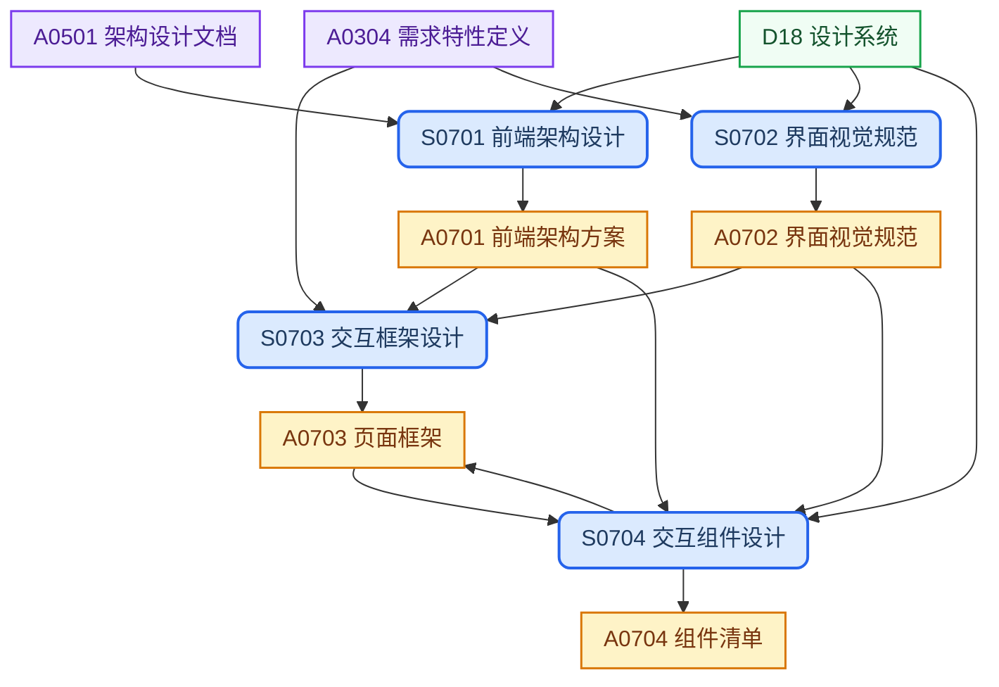

## 目录结构

跨 Feature 聚合提炼系统级前端技术上下文，产出前端架构方案、界面视觉规范、页面框架和组件清单。

```text
ui/
└── <platform>/                 # 平台级产品框架（browser、mobile 等）
    ├── architecture.md         # 前端架构方案
    ├── ui-specs.md             # 界面视觉规范
    ├── pages.md                # 页面框架
    └── components.md           # 组件清单
```

## 工作流程



## SOP规范

| ID | Name | Description | Process |
| :--- | :--- | :--- | :--- |
| S0701 | 前端架构设计 | 技术栈、路由、状态管理、构建工具选型，并对齐设计系统约束 | `{coding-base}/process/sop-frontend-arch-design.md` |
| S0702 | 界面视觉规范 | 制定视觉风格与组件规范 | `{coding-base}/process/sop-ui-spec-design.md` |
| S0703 | 交互框架设计 | 交互结构、页面编排、组件协同与状态流设计 | `{product-base}/process/sop-ui-framework-design.md` |
| S0704 | 交互组件设计 | 组件分层、能力抽象、接口约束与复用边界设计，并迭代回写页面框架 | `{product-base}/process/sop-ui-component-design.md` |

## 外部输入

| ID | Name | Description | Source |
| :--- | :--- | :--- | :--- |
| D18 | 设计系统 | 设计规范与设计语言标准 | `{coding-base}/ui-systems/<system>.md` |

## 上游输入

| ID | Name | Description | Source |
| :--- | :--- | :--- | :--- |
| A0501 | 架构设计文档 | 系统边界、模块划分、部署拓扑 | `architecture/architecture.md` |
| A0304 | 需求特性定义 | 页面与交互的产品需求描述（含交互需求上下文） | `requirements/<theme>/<epic>/<feature>/README.md` |

## 制品产出

| ID | Name | Description | File | Template |
| :--- | :--- | :--- | :--- | :--- |
| A0701 | 前端架构方案 | 技术栈选型、路由架构、状态管理策略、构建工具配置 | `<platform>/architecture.md` | `{coding-base}/template/front/front-arch.md` |
| A0702 | 界面视觉规范 | 视觉规范与标注稿 | `<platform>/ui-specs.md` | `{coding-base}/template/front/ui-spec.md` |
| A0703 | 页面框架 | 页面结构、信息架构、页面层级与路由编排（可由 S0704 迭代更新） | `<platform>/pages.md` | `{product-base}/template/ui/page-list.md` |
| A0704 | 组件清单 | 组件分类、职责边界、状态与复用策略 | `<platform>/components.md` | `{product-base}/template/ui/component-list.md` |

## 新老编号对比

本阶段的SOP和制品产出重新编号，分别按 `S0702` 和 `A0702` 进行统一排序。

### SOP

| 新编号 | 旧编号 | 名称 |
| :--- | :--- | :--- |
| S0701 | S123 | 前端架构设计 |
| S0703 | S124 | 交互框架设计 |
| S0704 | S124 | 交互组件设计 |
| S0702 | S17 | 界面视觉规范 |

### 制品

| 新编号 | 旧编号 | 名称 |
| :--- | :--- | :--- |
| A0701 | A122 | 前端架构方案 |
| A0703 | A123 | 页面框架 |
| A0704 | A123 | 组件清单 |
| A0702 | A18 | 界面视觉规范 |

## 备注

- 文档路径中的 `{product-base}` 指 [it188-networkx/product-base](https://github.com/it188-networkx/product-base) 仓库，
  通常作为独立子目录位于当前 workspace 根目录下。
- 文档路径中的 `{coding-base}` 指 [it188-networkx/coding-base](https://github.com/it188-networkx/coding-base) 仓库，
  通常作为独立子目录位于当前 workspace 根目录下。
